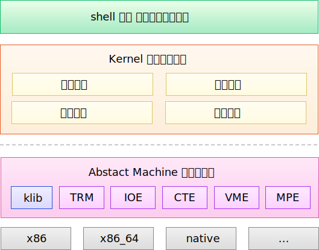

# 0.1 系统结构

## 0.1.1 系统模块

我们希望 SageOS 既能够拥有真正的操作系统特性，又不必过多地考虑体系结构相关的内容。因此，我们决定选用 Abstract Machine (以下简称 AM) 作为 SageOS 的硬件抽象层。

AM 为 SageOS 提供了 `arch-specific` 的抽象接口。通过使用 AM 提供的 API，我们能够专心于操作系统的部分。

SageOS 包括以下模块或内容：

| 名称     | 说明                                                                                               |
| :------- | -------------------------------------------------------------------------------------------------- |
| 内存管理 | 分配和回收物理内存、管理虚拟页表和进程虚拟内存                                                     |
| 进程管理 | 创建、回收和运行进程或线程，能够在用户态和内核态之间跳转                                           |
| 中断处理 | 处理各种中断事件，提供进程的休眠/唤醒机制                                                          |
| 系统调度 | 选用合适的调度算法，为进程分配 CPU 时间片                                                          |
| 文件管理 | 实现 inode 类型的文件系统； 实现虚拟文件系统上的统一接口，可供访问文件、进程 procfs、sda 设备 |

## 0.1.2 系统架构

整个 SageOS 的架构图如下：

其中，虚线上方加上 klib 为我们自行开发的内容，虚线下方除去 klib 后的属于 Abstrac Machine 的范畴。

整个系统自底向上依次是：

- 硬件体系结构层
  - 这一层中，与机器相关的的体系结构（例如 x86_64）向上提供接口
  - Abstract Machine 负责与具体的体系结构打交道，向上屏蔽了特定硬件架构的接口细节

- Abstract Machine 硬件抽象层。这一层提供了如下模块：
  - `TRM`: Turing Machine
  - `IOE`: Input/Output Devices
  - `CTE`: Interrupt Handling and Context Switching
  - `VME`: Virtual Memory
  - `MPE`: Multi-Processing
  - `klib`: 实现部分 C 库函数
- Kernel 操作系统内核层。这一层是整个系统的核心：
  - kernel 借助下层的硬件抽象接口，完成了整个操作系统的各个功能模块
  - 同时，kernel 向上为用户程序提供操作系统接口

- Shell 以及其它用户程序
  - shell 运行起来的样子，就是操作系统最终启动时“看起来”的样子！
  - 还有许多用户程序可以运行在操作系统上。

当然，以上只是一个大概的框架。除此之外，SageOS 还能够管理各类 IO 设备，比如 tty 终端、显示设备（显存）、串口输入等。这一部分的功能实现并非由我们实现，而是移植了第三方代码。[^1 移植自南京大学操作系统实验]

## 0.1.3 展望

基于操作系统提供的服务，我们最终应当能够实现这样的效果：

- 能够预编译用户程序为可执行文件，并存放在文件系统镜像中；
- 能够使用 shell 在 tty 设备上直接输入命令，动态加载可执行文件，运行用户进程；
- 借助中断处理，操作系统能够自由地调度和切换各个用户进程。

[^1]: 移植自南京大学操作系统实验
