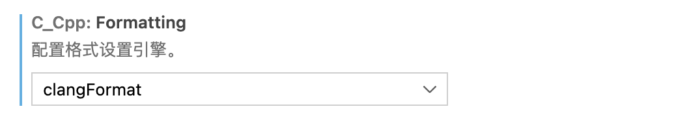
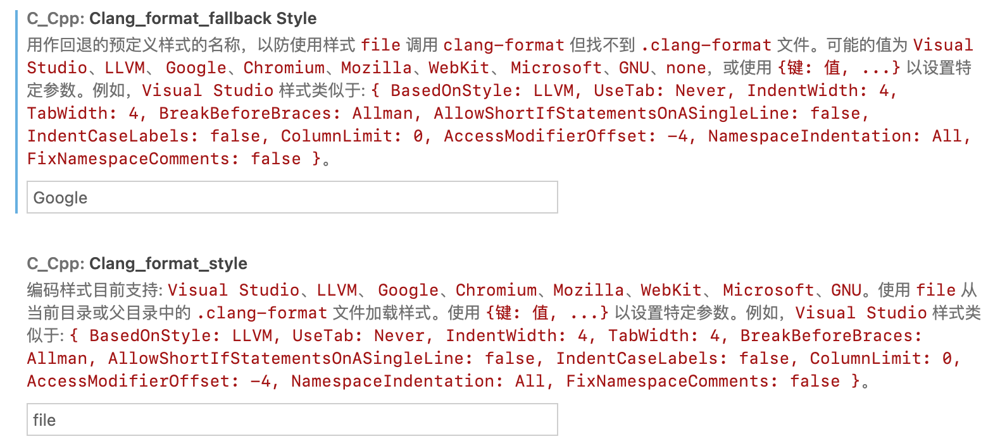
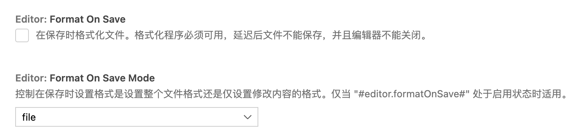

# 0.4 开发与协作

## 0.4.1 分组开发规划

整体上，将 SageOS 分为三大模块以及其它程序或库，共四部分。由于四部分之间存在相互依赖关系，无法进行同时开发，故将四部分的开发组编号为1、2、3、4组，分别负责如下：

- 1组：内存管理模块（2人）
  - 物理内存管理
  - 页表、虚拟内存管理
- 2组：进程/线程管理模块（4人）
  - 进程管理
  - 系统中断、上下文切换和调度算法
- 3组：文件系统
- 4组：基础功能、外围应用等
  - `4a-klib` 组：实现 stdio.c 以及 string.c 中的部分库函数（2人）
  - `4b-shell` 组：实现交互式 shell，功能包括部分系统指令、运行用户程序、输入和输出重定向（1人）
  - `4c-apps` 组：实现其它用户程序

从时间上看，各组的开发为“流水线”式开发。通常在上一组尚未开始时下一组并不能开始；当上一组完成部分工作后，例如完成一些数据结构或接口等设计后，下一组则可以开始工作。

## 0.4.2 git 协作流程

我们使用 git 进行版本管理、分支管理和协作开发。本节说明如何使用 git 进行协作。

### git 分支结构说明

我们设计了如下的分支结构：

- `branch:dev` 为默认分支（主分支）
- `branch:dev-{#}-{description}` 为每个组的开发分支。如 `dev-4a-klib` 表示4a开发组所用分支。
- `branch:fix-{#}-xxx` 为修复 bugs 所用的临时分支。
- `branch:archived` 为归档分支，此分支只可向外签出，不能修改。如果遇到了PR混乱的情况，需要将此版本的最新commit签出。

### 协作流程

以下阐述使用 git 进行开发协作的具体过程。

#### 初始化

当 sage-os 的远端仓库准备好后，将会向成员发送协作邀请，请前往邮箱进行确认。确认完毕后，成员需要：

1. 把仓库fork到自己的账号中；

2. 将fork后的仓库（在你自己的账户名下）clone 到本地：

   ```bash
   git clone git@github.com:xiaomin/sage-os.git
   ```

3. 运行 `git branch -a` 查看自己的分支，并切换到你对应的分支.

4. 设置upstream为远端仓库：

   ```bash
   git remote -v # 如果有upstream后不需要后续操作
   git remote add upstream git@github.com:moeakwak/sage-os.git
   ```

#### 准备阶段

1. 小组成员之间进行研讨，确定模块架构和功能组成

2. 进行API设计（头文件+注释文档），并按流程提交 Pull Request (PR)。以下为负责人相关操作：

   - 开发组立项：在远端仓库建立 `dev-{#}-{description}` 分支

   - 提交 issue（API 设计）

   - 在自己 fork 的仓库 fetch upstream，checkout 到该分支；在该分支上操作并完成API设计，且依照 doxygen 注释格式完成简要的注释

   - 提交 PR 申请

架构相关 PR 提交后，除本组成员之外，需要至少课设组长以及1名组外成员进行代码审核 (code review) 方可通过，并 merge 到 dev 分支.

#### 开发阶段

1. 开发组成员应当在 fork 仓库上拉取远端仓库的开发分支

   ```bash
   git fetch upstream
   git checkout <分支名称>
   ```

2. 完成你的功能开发后，就可以提交 PR 了. 提交后的代码，需交由同开发组的其他成员以及至少1名组外成员review。审核完毕后，将会进行 merge 操作。

如果在开发的过程中，有其他部分的代码更新，需要 pull upstream 以同步其他人的代码。

## 0.4.3 代码风格

为统一代码风格，我们使用 `clang-format` 软件进行自动格式化，其配置文件位于项目目录下的 `.clang-format` 。

代码风格包括使用小写字母和下划线命名符号、函数括号不换行、多行连续赋值自动对齐等。

首先需要安装该软件：

```shell
sudo apt install clang-format
```

之后，应当在 VSCode 中完成如下设置：

1. 确保格式化引擎为 `clangFormat`:

   

2. 设置 `format_style` 如下

   

3. 设置自动格式化（或使用快捷键 `Ctrl+Shift+F` 进行格式化）

   

## 0.4.4 注释和文档

为统一注释，SageOS 采用 Doxygen 风格的注释。例如：

```c
/**
 * @brief write bytes (including '\0')
 *
 * @param out output stream
 * @param fmt input format
 * @param ap variable list
 * @return int nums of characters
 */
int vsprintf(char *out, const char *fmt, va_list ap) {
  int ret = vsnprintf(out, INT32_MAX, fmt, ap);
  return ret;
}
```

此外，我们配置了 Doxygen 文档生成程序，它会根据代码中的注释自动创建 API 文档。

最终，项目包括两部分文档：

- 由 Doxygen 自动生成的文档
- 手动撰写的说明性文档

