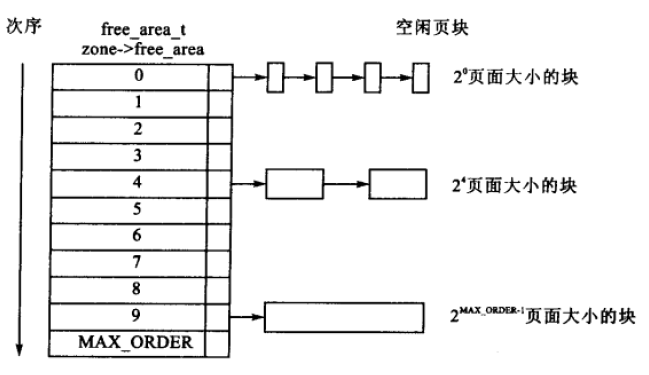

# 1.1 物理内存管理

## 1.1.0 对外api说明

完成物理内存的分配与释放。

```c
void* kalloc(size_t size);
void kfree(void* ptr);
```

## 1.1.1 伙伴系统

### 概述

为了方便管理内存，避免产生大量的内存碎片，需要一个内存管理系统来维护内存分配的过程，但是过于详细内存分配管理系统也会占用过大的内存空间（如：每一个内存单元对应一个管理单元，则内存空间会浪费一半），伙伴系统和slab分配器结合的物理内存管理也随之产生。

### 基本数据结构

```c
struct chunk {
  struct list_head node;
  uint8_t order;
  bool used;
  void* slab;
};
```

### 接口说明

```c
//内存块到起始地址转换
void* chunk2virt(struct pmm_pool* mm_pool, struct chunk* chunk);

//起始地址到内存块转换
struct chunk* virt2chunk(struct pmm_pool* mm_pool, void* virt);

//合并伙伴块
struct chunk* chunk_merge(struct pmm_pool* mm_pool, struct chunk* chunk);

//将内存块分解至指定秩
struct chunk* chunk_split(struct pmm_pool* mm_pool, uint8_t order,
                          struct chunk* chunk);

//向空闲队列中添加块
void chunk_append(struct pmm_pool* mm_pool, struct chunk* chunk);

//从空闲队列中删除块
void chunk_del(struct pmm_pool* mm_pool, struct chunk* chunk);

//分配内存块
struct chunk* chunk_alloc(struct pmm_pool* mm_pool, uint8_t order);

//释放内存块
void chunk_free(struct pmm_pool* mm_pool, struct chunk* chunk);

//初始化伙伴系统
void buddy_init(struct pmm_pool* mm_pool, struct chunk* start_chunk,
                void* start_addr, uint64_t page_num);

//获取伙伴块
struct chunk* get_buddy_chunk(struct pmm_pool* mm_pool, struct chunk* chunk);
```

### 设计思路

伙伴系统巧妙的将地址的二进制表示法和线段树的二分性进行了巧妙的结合，系统的基本数据结构是``struct chunk``，后面都会简称为``块``，它维护着$2^{order}$个页。当一个大小的内存请求到来时，首先计算满足条件的最小秩为多少，然后向伙伴系统申请相应秩的内存块。

伙伴系统中维护着一个分级队列，即对应着块的秩。首先系统会检查申请秩的队列，如果有空闲则直接分配；如果没有则进行向上查找，直到找到可用块，随后将其不断二分，直到分离到需要的秩。然后通过内存转换得到对应的其实物理地址。

当回收内存时，递归合并伙伴块，直到所对应伙伴块已经被分配或无伙伴块。

#### 分配内存时的流程

```flow
st=>start: 接收到分配请求
ed=>end: 返回分配地址
op1=>operation: 计算最小秩
cond1=>condition: 空闲列表中是否有所需的块
op1.1.1=>operation: 直接分配
op1.1.2=>operation: 将该块从空闲列表中删除
op3=>operation: 通过块地址计算分配地址
op1.2.1=>operation: 向上查找可用块
cond1.2=>condition: 是否有可用块
ed2=>end: 返回空指针
op1.2.2.1=>operation: 将可用块递归分裂，至所需秩
op1.2.2.2=>operation: 将每次分裂的另一半加入空闲队列

st->op1->cond1
cond1(yes)->op1.1.1->op1.1.2->op3
cond1(no)->op1.2.1->cond1.2
cond1.2(yes)->op1.2.2.1->op1.2.2.2(left)->op3
cond1.2(no)->ed2
op3->ed
```


#### 释放内存时的流程

```flow
st=>start: 接收到释放请求
op1=>operation: 将指针转换为块的地址
op2=>operation: 递归合并伙伴块
op3=>operation: 将块加入空闲队列
ed=>end: 释放成功

st->op1->op2->op3->ed
```


### 设计细节

#### 堆区的构造

如图所示：

```
      heap_end<---+--------------+
                  |   metadata   +--->pool&chunk(pages),etc.
    meta_start<---+--------------+      (for kernel)
                  |              |
                  |              |
                  |              |
                  |     free     |
                  |    spaces    |
                  |  (for user)  |
                  |              |
                  |              |
    heap_start<---+--------------+
```

#### 内存池设计

为了方便管理元数据，我们设计了内存池。结构如下：

```c
struct pmm_pool {
  uint64_t begin_addr;
  uint64_t page_num;
  uint64_t size;
  struct chunk* chunk_metadata;
  struct free_list free_lists[BUDDY_MAX_ORDER];
};
```

其中包括了堆区地址``begin_addr``，页数，总大小，块元数据起始地址``chunk_metadata``，以及空闲链表（链表设计见[``list.h``设计说明](../4.apps/4.3-list.md)）。

#### 元数据初始化

1. 页面数量

   遵循着我们对堆区分配的设计，一个页对应着一块元数据，在已知堆区的起始地址和终止地址后，我们可以如下计算出页面数量。

   ```c
   nr_page =
         (uint64_t)(heap.end - heap.start) / (SZ_PAGE + sizeof(struct chunk));
   ```

2. 起始地址

   堆区起始地址只需要调用``abstract machine``的接口``Area heap``即可，而元数据起始地址的计算就是堆区起始地址偏移``SZ_PAGE * nr_page``即可。

   ```c
   pg_start = heap.start;
   pi_start = (bool*)(pg_start + nr_page * SZ_PAGE);
   ```

3. 空闲块初始化

   现在在内存池中已经有了``nr_page``个秩为0的内存块，现在对这些内存块遍历：如果该内存块的伙伴块在空闲队列中，则重复进行合并操作，并将最后的内存块加入空闲队列；如果不在空闲队列中，则直接加入空闲队列。
   
   

#### 获取伙伴块

在考虑这个问题之前，我们需要对内存地址有一定的了解。

我们有伙伴系统的前提是，分配的空间在地址逻辑上是连续的。这样我们才有了如下的内存地址格式。

```
    +---------------------------------+-------------------+
    |            base addr            |      offset       |
    +---------------------------------+-------------------+
    |                                                     |
    |<-----------------------64bits---------------------->|
    |                                                     |
```

而对于``offset=0``的内存块来说，大小为4个内存单元时，下一个内存块就应该是``offset=4``而此时二进制表示法为``0x0100``。所以我们有一个假说，即我们获取对应块的内存地址的公式为${address}\oplus(1 << (order+log_2({pagesize})))$。因为二进制的特殊性，我们可以无进位加法和减法没有区别，都可以使用异或进行运算。

#### 块地址与起始内存地址转换算法

我们假定单元内存块都分配着一个页，这样的话第n个内存块对应着第n个内存单元页，而无论对应块的order为多少，它所对应的起始内存地址都不会改变。由此可以易得，地址转换的公式为``(chunk - chunk_metadata) * SZ_PAGE + begin_addr``，反之亦然。


伙伴算法具有以下一些缺点：

* 一个很小的块往往会阻碍一个大块的合并，一个系统中，对内存块的分配，大小是随机的，一片内存中仅一个小的内存块没有释放，旁边两个大的就不能合并。

* 算法中有一定的浪费现象，伙伴算法是按2的幂次方大小进行分配内存块，当然这样做是有原因的，即为了避免把大的内存块拆的太碎，更重要的是使分配和释放过程迅速。但是他也带来了不利的一面，如果所需内存大小不是2的幂次方，就会有部分页面浪费。有时还很严重。比如原来是1024个块，申请了16个块，再申请600个块就申请不到了，因为已经被分割了。
* 另外拆分和合并涉及到 较多的链表和位图操作，开销还是比较大的。

## 1.1.2 SLAB 分配器

### 概述

伙伴算法采用页框作为基本内存区，适合于大块内存请求，而当进行小片内存分配的申请时，就会产生内部碎片，造成内存的浪费。为满足进程或者系统对小片内存的请求，对内存管理粒度更小的SLAB分配器就产生了。

### 接口说明

```c
//初始化slab分配器
void slab_init(void);

//对slab分配器内不同粒度的小内存进行初始化
static slab_header_t *init_slab_cache(int order, int size);

//向伙伴系统申请指定大小的内存并标为slab使用
static void *alloc_slab_memory(u64 size);

//向slab申请内存
void *alloc_in_slab(u64 size);
static void *_alloc_in_slab(slab_header_t *slab_header, int order);

//单核无并发下的slab内存分配
static void *_alloc_in_slab_nolock(slab_header_t * slab_header, int order);

//slab释放内存
void free_in_slab(void *addr)
```

### 设计思路

slab分配器是在buddy system的基础之上运行的，分配器为不同粒度的小内存块单独维护各自的队列。初始化时分配器为每个内存粒度向buddy system申请一定大小的内存块，并按照粒度将其分割成队列。

分配内存时首先定位到对应的粒度，然后遍历队列寻找可用内存块，若存在则将其返回，若已满则向buddy system申请一块新内存并从其中分配一块小内存块并返回，同时更新可用队列。

释放时定位到该内存块所属的slab并将该内存插入队列头供下次分配使用。

#### 分配内存时的流程

```flow
st=>start: 接收到分配请求
op1=>operation: 根据请求内存大小定位到相应粒度的slab
op2=>operation: 遍历slab，寻找可用slot
cond1=>condition: 存在可用slot
ed1=>end: 分配该slot
op3=>operation: 向buddy system申请内存，初始化为slab
op4=>operation: 更新slab队列
ed2=>end: 从该slab中分配slot

st->op1->op2->cond1
cond1(yes)->ed1
cond1(no)->op3->op4->ed2
```

#### 释放内存时的流程

```flow
st=>start: 接收到释放请求
op1=>operation: 定位到slab队列中的所属slab
op2=>operation: 将该内存对应的slot插入slot可用队列头
ed=>end: 结束

st->op1->op2->ed
```

### 设计细节

#### slab分配器的构造

slab分配器有很多种，此处使用数组与链表相结合的形式，为不同大小的小内存申请分别维护一个内存链表。

```c
//slabs数组，存放不同大小的内存链表
slab_header_t *slabs[SLAB_MAX_ORDER + 1];

//针对特定大小的小片内存申请的内存链表
typedef struct slab_header slab_header_t;
struct slab_header {
	void *free_list_head;//链表头
	slab_header_t *next_slab;//链表用完时向buddy system申请新的slab
	int order;//该链表维护的内存块的大小
};

```

结构如图所示:

```
                                                                +----------------+
                                                                |    occupied    |
                                                                +----------------+
                                                                |      ...       |
                                                                +----------------+
   slabs<---+----------------+     |--->+----------------+      |    occupied    |
            |  slabs[0]=null +     |    | free_list_head |----->+----------------+
            +----------------+     |    +----------------+      |      free      |
            |  slabs[1]=null |     |    |   next_slab    |---|  +----------------+
            +----------------+     |    +----------------+   |  |      ...       |
            |       .        |     |    |     order      |   |  +----------------+
            |       .        |     |    +----------------+   |  |      free      |
            |       .        |     |                         |  +----------------+
            +--------------- +     |                         |  |      null      |  
            |slabs[MIN_ORDER]|-----| |-----------------------|  +----------------+
            +----------------+       |                               slot_list         
            |      ...       |       |->+----------------+             
            +--------------- +          | free_list_head |-----
            |slabs[MAX_ORDER]|          +----------------+                          
            +----------------+          |   next_slab    |---                          
                                        +----------------+
                                        |     order      |
                                        +----------------+

```

#### slab分配器的初始化

```c
//对数组内不同大小内存的链表进行初始化
for (order = SLAB_MIN_ORDER; order <= SLAB_MAX_ORDER; order++) {
		slabs[order] = init_slab_cache(order, SLAB_INIT_SIZE);
	}
```

#### 区分内存管理者的关键：chunk->slab

当调用kfree()回收某个对象的内存时，会遇到这样的问题：无法确定该内存是由buddy system还是slab allocator进行维护的。此时chunk结构体中的slab能够起到分辨的作用，从而调用正确的回收机制。

回顾一下chunk结构体:

```c
struct chunk {
  struct list_head node;
  uint8_t order;
  bool used;
  void* slab;
};
```

调用kfree()时，若一块chunk是从buddy system中分配的，则slab因未被赋值，所以值为null，而若是属于slab的内存，则其值为该块内存的起始地址。如下所示：

```c
static void *alloc_slab_memory(u64 size)
{
	struct chunk *p_chunk, *chunk;
	void *addr;
	u64 order, chunk_num;
	void *chunk_addr;
	int i;
	order = size_to_order(size / SZ_PAGE);
	p_chunk = chunk_alloc(&global_mm_pool, order);
	addr = chunk2virt(&global_mm_pool, p_chunk);
	chunk_num = order_to_size(order);
	for (i = 0; i < chunk_num; i++) {
		chunk_addr = (void *)((u64) addr + i * SZ_PAGE);
		chunk = virt2chunk(&global_mm_pool, chunk_addr);
		chunk->slab = addr;//slab被赋值，不为null
	}
	return addr;
}
```
kfree()中，通过地址转换由起始内存地址得到块地址，进而判断该块的归属：

```c
static void kfree(void* ptr) {
  struct chunk* chunk = virt2chunk(&global_mm_pool, ptr);
  if (chunk && chunk->slab)//chunk->slab!=null,表明属于slab
    free_in_slab(ptr);
  else//否则属于buddy system
    chunk_free(&global_mm_pool, chunk);
}
```

#### 内存的分配与释放

分配：在slab中分配内存时，分配器首先通过请求的内存大小定位到slabs数组的相应位置i，然后在slabs[i]的当前slab中寻找可分配的slot，若已分配完，则转向next_slab寻找，并一直找下去直到找到空闲slot(则返回该slot给kalloc)或到链表尾(slab[i]中无可用slot)，无可用slot时则向buddy system请求一块新的chunk，将其初始化为slab并置于链表头，然后从这块新的slab中分配slot。

释放：释放内存时，首先通过地址转换得到该slot所属的slab，然后将该slot置于slab的free_list链表头(即：当一个slot被分配后，其与前后slot的位置关系便不再被维护，而是在释放后将该slot直接放回原slab)
```c
void free_in_slab(void *addr)
{
	struct chunk *chunk;
	slab_header_t *slab;
	slab_slot_list_t *slot;
	slot = (slab_slot_list_t *) addr;
	chunk = virt2chunk(&global_mm_pool, addr);//转换地址得到chunk
	slab = chunk->slab;//得到所属slab
	slot->next_free = slab->free_list_head;
	slab->free_list_head = slot;//释放的内存插入链表头
}
```

## 1.1.3 总体流程

### 初始化

```flow
st=>start: 操作系统内核启动
op1=>operation: 内存管理系统启动
op2=>operation: 初始化buddy system
op3=>operation: 初始化slab分配器
ed=>end: ...

st->op1->op2->op3->ed
```

### 分配

```flow
st=>start: kalloc(size)
e=>end: 返回地址
cond1=>condition: size<=最大的slot的大小
op1=>operation: alloc in slab
op2=>operation: alloc in buddy system

st->cond1
cond1(yes)->op1->e
cond1(no)->op2->e
```

### 释放

```flow
st=>start: kfree(ptr)
e=>end: void
cond1=>condition: chunk->slab!=null
op1=>operation: free in slab
op2=>operation: free in buddy system
op3=>operation: 地址转换得到所属chunk

st->op3->cond1
cond1(yes)->op1->e
cond1(no)->op2->e
```
