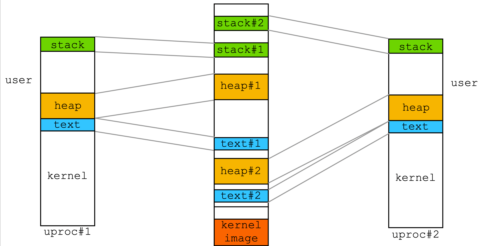
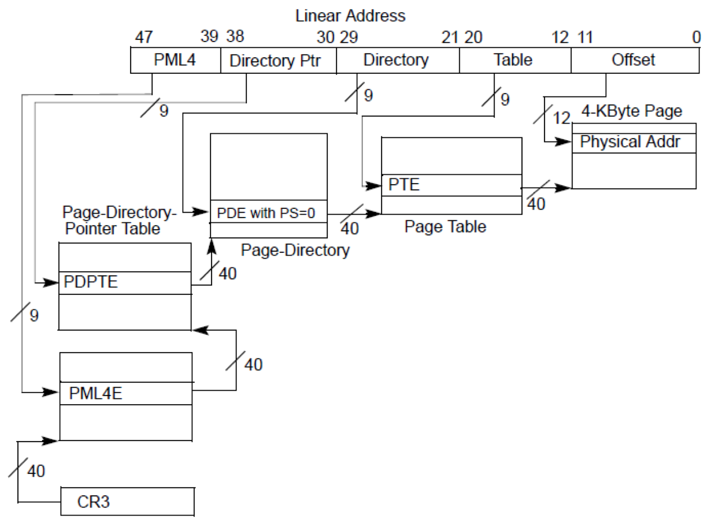

# 1.2 虚拟内存管理

## 思路概述

虚拟内存是计算机系统内存管理的一种技术。它使得应用程序认为它拥有连续可用的内存（一个连续完整的地址空间），而实际上物理内存通常被分隔成多个内存碎片，还有部分暂时存储在外部磁盘存储器上，在需要时进行数据交换。与没有使用虚拟内存技术的系统相比，使用这种技术使得大型程序的编写变得更容易，对真正的物理内存（例如RAM）的使用也更有效率。此外，虚拟内存技术可以使多个进程共享同一个运行库，并通过分割不同进程的内存空间来提高系统的安全性。

在SageOS中，为了进一步接近现代操作系统，我们也设计了虚拟内存机制，每一个进程都有一个自己的虚拟进程映射空间，并以此基础，实现内核态/用户态隔离以及系统调用。

### 地址空间安排



### ``x86_64`` 四级页表



上图是 ``x84`` 架构中的四级页表结构。64位地址占用空间为8 bytes，需要四级页表来对全64位空间进行映射。而算法的核心就是 ``vme.c`` 中的 ``ptwalk`` 函数，用于获取页框项，并对此进行操作。

```c
static uintptr_t *ptwalk(AddrSpace *as, uintptr_t addr, int flags) {
  uintptr_t cur = (uintptr_t)&as->ptr;

  for (int i = 0; i <= mmu.ptlevels; i++) {
    const struct ptinfo *ptinfo = &mmu.pgtables[i];
    uintptr_t *pt = (uintptr_t *)cur, next_page;
    int index = indexof(addr, ptinfo);
    if (i == mmu.ptlevels) return &pt[index];

    if (!(pt[index] & PTE_P)) {
      next_page = (uintptr_t)pgallocz();
      pt[index] = next_page | PTE_P | flags;
    } else {
      next_page = baseof(pt[index]);
    }
    cur = next_page;
  }
  bug();
}
```

算法的细节不多赘述，简单的概括就是逐层遍历页表，获取最终的页框。

### 页框替换算法

#### LRU

``LRU`` 算法在软件上的实现是基于已有的双向循环链表轮子来实现的，替换算法是在虚拟内存的系统接口层之上实现的，每一次发生缺页中断后，操作系统会向算法接口请求一个可用的页框（物理内存地址），随后完成映射操作。

而在算法内部，定义了一个双向循环链表记录访问顺序和映射数量，如果未映射满，则直接申请新的空间；如果映射满了，则从链表尾部取出页框，调度到链表头部，并返回地址。

```c
struct frame {
  intptr_t paddr;
  struct list_head list;
};

struct frame frames[20][FRAME_NUM];
struct list_head head[20];
int occupied_frame[20];

intptr_t pick_next_LRU(task_t* proc) {
  if (occupied_frame[proc->pid] == 0) {
    INIT_LIST_HEAD(&head[proc->pid]);
  }
  if (occupied_frame[proc->pid] < FRAME_NUM) {
    intptr_t ptr                               = pmm->pgalloc();
    frames[occupied_frame[proc->pid]++]->paddr = ptr;
    return ptr;
  } else {
    struct frame* frame = list_entry(&head[proc->pid].prev, struct frame, list);
    list_del(&frame->list);
    list_add(&frame->list, &head[proc->pid]);
    return frame->paddr;
  }
}
```


## 代码实现讲解

### 抽象层接口

在具体讲解上述接口之前，我们要简单介绍一下 ``abstract-machine`` 中为我们提供的虚拟内存抽象层接口 ``vme``（详细介绍见[abstract-machine接口分析]()）。

#### 数据结构

在 ``vme`` 中，底层逻辑将虚拟内存映射信息抽象到了一个结构体 ``AddrSpace`` 中，其具体定义如下所示：

```c
typedef struct {
  int pgsize;
  Area area;
  void *ptr;
} AddrSpace;
```

根据 ``x86_64`` 机制，我们只需要把 ``cr3`` 寄存器设置成 ``ptr`` 的值，在 ``qemu`` 平台的模拟机制下，就可以完成映射逻辑。

#### 功能函数

在 ``vme`` 中，为我们提供了如下几个功能接口：

``` c
// 初始化虚拟内存机制
bool     vme_init    (void *(*pgalloc)(int), void (*pgfree)(void *));
// 将一个映射页表注册入AddrSpace
void     protect     (AddrSpace *as);
// 将一个映射页表销毁
void     unprotect   (AddrSpace *as);
// 映射地址
void     map         (AddrSpace *as, void *vaddr, void *paddr, int prot);
// 获取某个页表所对应的上下文
Context *ucontext    (AddrSpace *as, Area kstack, void *entry);
```

有了这些函数，我们就可以完成对虚拟内存的原子操作。

##### ``vme_init``

该函数是激活整个虚拟内存机制的函数。函数首先定义了一个跨平台的虚拟内存空间，在 ``x86_64`` 架构下，定义了64位中第一位为0的前512G（前39位）为内核地址空间，为自身映射；而64位中的第一位为1的前512G为用户内核地址空间，依照不同进程的页表进行映射。

 ``x86_64`` 的页表存储在地址 ``0x1000`` 中。

##### ``protect``

如前文所提到的，``vme.c`` 将虚拟内存接口抽象成为了一个``Addrspace``，一个进程持有了这个属性，就可以在程序员的角度显式的展示出映射表的地址与范围。而这个函数的作用就是初始化我们的 ``Addrspace`` 属性，将内核态地址映射载入页表，并将页表的地址空间赋值给``Addrspace`` 中。

##### ``unprotect``

与上文 ``protect`` 相反，这是一个销毁映射，并释放页表空间的函数。

##### ``map``

这是一个映射函数，同时也是一个销毁映射的函数。当保护标志没有 ``MMAP_NONE`` 时，可以进行读/写权限映射；反之，则将所映射内存所在的页取消映射。

### 系统接口层接口

在 ``vm.h`` 中，我们在 ``x86-64`` 四级页表的基础之上，为上层应用（如：系统调用，文件系统）提供虚拟内存接口，包括一下几个功能函数。

```c
// 映射地址并打印日志
void uproc_pgmap(task_t* proc, void* vaddr, void* paddr, int prot);
// 取消映射地址
void uporc_pgunmap(task_t* proc, void* vaddr);
// 初始化用户进程的虚拟地址空间
void inituvm(task_t* proc, unsigned char* init, int sz);
// 将用户堆区大小从oldsz增加到newsz
int allocuvm(task_t* proc, int newsz, int oldsz);
// 复制用户进程虚拟地址空间
void copyuvm(task_t* proc, task_t* src, int sz);
// 将用户堆区大小从oldsz减少到newsz
int deallocuvm(task_t* proc, int newsz, int oldsz);
```

#### ``uproc_pgmap``

这个函数通过LRU算法，找到合适的页框，然后调用抽象层的 ``map`` 函数，并将日志记录打印出来。

#### ``uproc_pgunmap`` 

这个函数会调用抽象层的 ``map`` 函数，并将标志位设置为 ``MMAP_NONE`` 执行取消映射操作。

#### ``inituvm``

这个函数为进程开辟一个页面大小的内存空间，并将初始化代码（主要是第一个进程代码）载入进程空间。在第一个用户进程初始化中调用该函数。

#### ``allocuvm``

这个函数为进程的堆区分配新的空间，并返回新空间的大小。在 ``sbrk`` 系统调用中，``n`` 大于0时调用。

#### ``deallocuvm``

这个函数为进程的堆区减少空间，并返回新空间的大小。在 ``sbrk`` 系统调用中，``n`` 小于0时调用。

#### ``copyuvm``

这个函数将一个进程的虚拟内存映射复制到新的进程的虚拟内存映射。在 ``fork`` 系统调用中使用。
