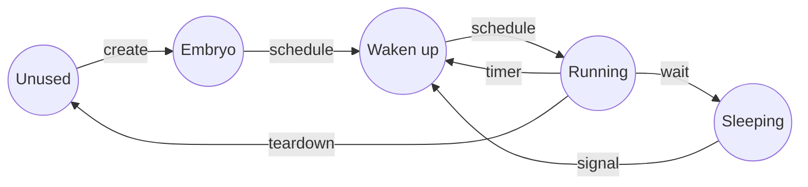

# 2.2 进程数据结构设计

## 2.2.1 PCB (task_t) 数据结构

`task_t` 在课本中的解释是进程控制块，但是在操作系统设计者的眼中，它是一个将我们视角中的进程和 cpu 视角中的进程联系起来的结构体（context 和 stack 是机器视角的）。

在机器的视角，它们看到的只有进程的栈空间以及各种寄存器（也就是我们常说的上下文），试想一下，如果我没有 task 甚至说没有 kmt，我只是在每一次中断时候随机设置我的 esp 和 rip 寄存器，我的机器也可以跑起来，如此可以说我们的操作系统是一个一根控制整个系统稳定运行的线。

我们设计的 PCB 数据结构如下：

```c
struct task {
  uint32_t pid;                   // process id
  const char* name;               // process name for debug
  void (*entry)(void*);           // kernel thread entry
  void* arg;                      // args of entry func
  enum task_states state;         // process state
  sem_t* wait_sem;                // semaphore that the thread waiting for
  bool killed;                    // whether process is killed
  int32_t owner;                  // which cpu running this process now
  int32_t count;                  // a counter to avoid deadlock
  char fenceA[STACK_FENCE_SIZE];  // 32 bytes fence
  char stack[STACK_SIZE];         // user stack
  char fenceB[STACK_FENCE_SIZE];  // 32 bytes fence
  Context* context;               // process user context
  struct task* parent;

  AddrSpace as;       // proc address space
  int pmsize;         // proc memory size
  struct task* next;  // next task in linked list
};
```

其中，各属性的说明如注释所示。

## 2.2.2 进程状态转移图

进程包括如下状态：

```c
enum task_states {
  ST_U,  // Unused
  ST_E,  // Embryo
  ST_S,  // Sleeping
  ST_W,  // Waken up
  ST_R,  // Running
  ST_X   // Special
};
```

进程状态转移图如下：



此外，在设计 fork/wait 机制、允许中断嵌套后，进程可能会有更微妙的状态改变。具体请见中断一节。
