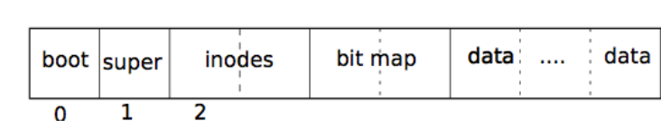
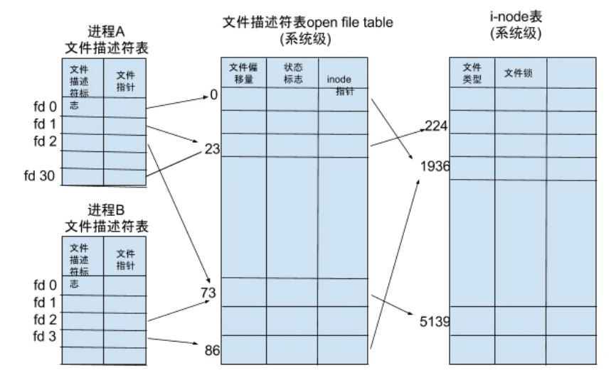
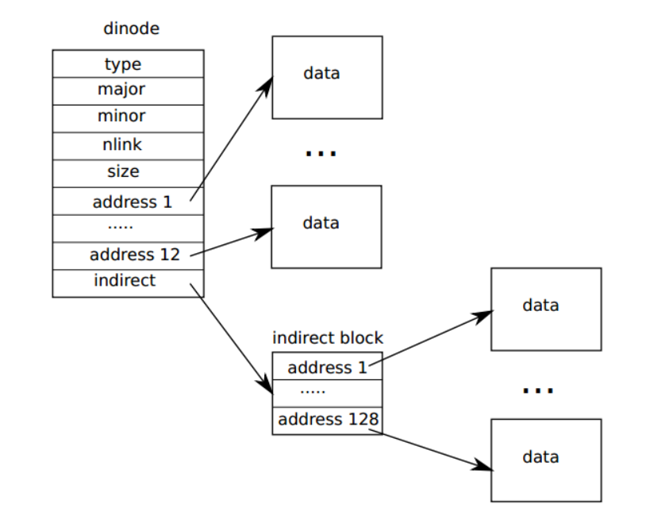

# 3.1 文件系统实现
## 3.1.1 磁盘读写接口
相比于真正的磁盘，AM提供了一个抽象的磁盘接口，使得可以通过调用底层接口 ``dev->read()`` 和 ``dev->write()`` 对磁盘进行随机读写。但是磁盘结构仍是由自己定义。因此我们在可随机读写的基础上，定义了属于自己的磁盘结构以及各种数据结构及其读写方法。在这一小节将会先介绍我们所定义的磁盘结构，再介绍存储在磁盘上的数据结构和他们的一些读写方法。
### 3.1.1.1 磁盘结构

磁盘结构如上图所示，前 1MB 的空间留给 ``boot`` ,从 ``boot`` 往后第一个块存放 ``superblock_t`` ，第二个块开始存放 ``dinode_t`` 节点, ``dinode_t`` 节点结束后的下一个块开始存放 ``bit map`` ,接下来的块开始存放一系列的数据块 ``block`` .

### 3.1.1.2 磁盘上存储的数据结构
#### superblock
```c
typedef struct superblock {
  uint32_t size;        // Size of file system image (blocks)
  uint32_t nblocks;     // Number of data blocks
  uint32_t ninodes;     // Number of inodes.
  uint32_t inodestart;  // Block number of first inode block
  uint32_t bmapstart;   // Block number of first free map block
} superblock_t;
```
``size`` 代表整个虚拟磁盘的大小。
``nblocks`` 代表数据块的个数。
``ninodes`` 代表 dinode 节点个数，值得一提的是，考虑到磁盘上最多只有 nblocks 个数据块，因此 dinode 节点数量与其设置成相同大小。
``inodestart`` 代表第一个inode节点开始的块号。
``bmapstart`` 代表第一个位图开始的块号。
#### dinode
```c
#define DINODE_TYPE_N 0                           // unused
#define DINODE_TYPE_F 1                           // file
#define DINODE_TYPE_D 2                           // directory
#define NDIRECT       12                          // num of direct address
#define NINDIRECT     (BSIZE / sizeof(uint32_t))  // 128

typedef struct dinode {
  short type;                   // File type
  short nlink;                  // Number of links to inode in file system
  uint32_t size;                // Size of file (bytes)
  uint32_t addrs[NDIRECT + 1];  // Data block addresses
} dinode_t;
```
``dinode_t`` 是存储在磁盘上的 inode 节点，其中包含了节点类型 ``type`` ,其可选参数在 define 定义中给出。 ``nlink`` 表示inode在文件系统里面的链接数，如果nlink为0，说明inode对应的文件已经被删除； ``size`` 表明了该节点对应的数据大小， ``addrs`` 则用于存储节点对应的块的块号。数组大小 +1 是因为最后一项存放间接地址块号。
### 3.1.1.3 内存中存储的数据结构
#### block
```c
#define NBLOCK        1024  // data block num
#define BSIZE         512   // block size

typedef struct block {
  uint32_t blk_no;
  uint8_t data[BSIZE];
} block_t;
```
``block_t`` 数据结构是块的一个缓冲，用于存放要读出的块的内容。
#### dirent
```c
#define PATH_LENGTH   32                          // path max length

typedef struct dirent {
  uint16_t inum;
  char name[PATH_LENGTH];
} dirent_t;
```
``dirent_t`` 存放目录名以及它对应的inode编号。
#### inode
```c
typedef struct inode {
  device_t* dev;    // Device
  uint32_t inum;    // Inode number
  int ref;          // Reference count
  spinlock_t lock;  // protects everything below here
  // delete valid because all inodes will be in memory at boot
  // int valid;

  short type;                   // File type
  short nlink;                  // Number of links to inode in file system
  uint32_t size;                // Size of file (bytes)
  uint32_t addrs[NDIRECT + 1];  // Data block addresses
} inode_t;
```
``inode_t`` 是存放在内存中的 inode 节点。从磁盘读取节点后，要对其附加一些信息，并存放在内存中的 inode 缓冲区内。其中 
``dev`` 表示节点的设备，因为只有一个虚拟磁盘，所以只有一种选择。
``inum`` 表示节点编号，与其在磁盘中的位置顺序相同。
``ref`` 表示此inode被进程引用的次数，如果ref为0，就说明当前没有进程使用这个inode。
``lock`` 用于锁住对于其下方数据的操作，下方的数据与 ``dinode_t`` 相同。
### 3.1.1.4 其他定义
```c
//------------------一些用于计算地址偏移量的定义------------------------------------------
#define ROUNDUP_BLK_NUM(i) \
  (((i + BSIZE - 1) / BSIZE) * \
   BSIZE)  // 偏移量i对块大小向上取整，例如地址648对块大小512向上取整是1024

#define OFFSET_BOOT     (1024*1024)   //boot区域的偏移量，1MB
#define OFFSET_SB       512 //superblock偏移量，占一个块
#define OFFSET_INODE(i) (OFFSET_BOOT + OFFSET_SB + (sizeof(dinode_t) * i))//inode节点i偏移量
#define OFFSET_ALLINODE \
  (OFFSET_BOOT + OFFSET_SB + ROUNDUP_BLK_NUM((sizeof(dinode_t) * NBLOCK)))//最后一个inode节点结束的偏移量
#define OFFSET_BITMAP(i) (OFFSET_ALLINODE + (i / 8))                    //位图i地址偏移量
#define OFFSET_ALLBITMAP (OFFSET_ALLINODE + NBLOCK / 8)                 //最后一个位图结束的偏移量
#define OFFSET_BLOCK(i)  (ROUNDUP_BLK_NUM(OFFSET_ALLBITMAP) + i * BSIZE)//数据块的偏移量
```
以上的一些定义都是为了方便快速获取如 inode , bitmap 和 data block 的地址偏移量。
### 3.1.1.5 文件系统接口函数

这里的文件系统接口函数是指对磁盘上的数据块和数据结构进行读写，并不涉及inode节点内的文件内容写入。未提及部分会在inode接口中做详细解释。该部分实现由于大部分是对地址偏移量进行操作，没有太多值得一提的巧妙思想，因此不对实现细节进行展开描述。（但偏移量设计和使用有时真的很容易把人绕晕）
```c
//初始化，主要设置superblock的各项参数并且写入磁盘
void fs_init();

//向设备dev写入superblock
void fs_createsb(device_t* dev, superblock_t* sb);

//从设备dev读取superblock
void fs_readsb(device_t* dev, superblock_t* sb);

//从设备dev中按照数据块号blk_no读取块，存放在buf中。其中偏移量根据前面所定义的OFFSET_BLOCK(blk_no)获得
void fs_readblk(device_t* dev, uint32_t blk_no, block_t* buf);

//从设备dev中按照数据块号blk_no写入块，内容为buf中的data。其中偏移量根据前面所定义的OFFSET_BLOCK(blk_no)获得
void fs_writeblk(device_t* dev, uint32_t blk_no, block_t* buf);

//清空一个数据块，将数据置零。要注意的是，该函数并不会释放清零的块。
void fs_zeroblk(device_t* dev, uint32_t blk_no);

//分配一个空的数据块（其位图为0），返回分配的块号
uint32_t fs_allocblk(device_t* dev);

//释放编号为blk_no的数据块。要注意的是，释放并不会清空块内数据。只是将其在位图中的bit置零。
void fs_freeblk(device_t* dev, uint32_t blk_no);

//读取编号为inode_no（从0开始）的inode并放在参数inode中包含dinode数据的部分，并构造其它部分。
void fs_readinode(device_t* dev, uint32_t inode_no, inode_t* inode);

//将inode中的dinode信息写入磁盘。
void fs_writeinode(device_t* dev, uint32_t inode_no, inode_t* inode); 
```
## 3.1.2 文件描述符与文件接口
### 概述
文件描述符在形式上是一个非负整数。实际上，它是一个索引值，指向内核为每一个进程所维护的该进程打开文件的记录表。当程序打开一个现有文件或者创建一个新文件时，内核向进程返回一个文件描述符。
在我们的文件系统中，系统维护一张总的文件描述符表 ``ftable`` ,所有对于已经打开的文件的操作都是对 ``ftable[fd]`` 所指向的文件操作，其中 ``fd`` 代表全局文件描述符。

在每一个进程中，有一张进程的文件描述符表 ``fdtable`` ，其为一整型数组，大小设置为 16 。 ``fdtable`` 的下标代表进程自己的局部文件描述符，下标位置存放的整型值代表系统的全局文件描述符。可以理解为 ``fdtable`` 是进程文件描述符到系统文件描述符的一个简单映射。除了 ``stdin\stdout\stderr`` 三中标准输入输出占据了 ``fdtable`` 的 0\1\2 表项，每个进程还可以打开13个额外的文件。此外，若 ``fdtable`` 表项内值为 -1 ，则代表进程的此局部文件描述符可用。下图是通常的文件描述符表的映射关系。


我们的文件系统中，进程文件描述符表没有文件指针一项，取而代之的是简易的系统文件描述符表下标 fd 。简单的例子：如果一个进程 ``fdtable[4]=27`` ，则表明该进程的进程文件描述符 4 对应的系统文件描述符表的下标是 27 ，可以通过接口函数 ``file_get(process->fdtable[4])`` 来获得该文件的指针。
### 3.1.2.1 数据结构定义
#### file
```c
typedef struct file {
  enum { FD_NONE, FD_INODE } type;
  int ref;  // reference count
  char readable;
  char writable;
  struct inode* iptr;
  uint32_t off;
} file_t;
```
file_t是文件类型。其中 ``type`` 代表了文件的类型，在这里只有 ``空(FD_NONE)`` 和 ``指向inode(FD_INODE)`` 两种。 ``ref`` 代表该文件被多少进程文件描述符所指向，为 0 则表示该文件已无引用，可被覆盖。 ``readable`` 和 ``writable`` 分别代表了文件的可读写属性，该属性会在系统调用 ``sys_open`` 中给出，即在文件创建时给出。 ``iptr`` 即该文件所指向的 inode , ``off`` 代表了该文件当前的指针偏移量。
#### file table
```c
typedef struct file_table {
  spinlock_t lock;
  file_t files[FILE_TABLE_SIZE];
} filetable_t;
```
``filetable_t`` 是系统文件描述符表。其中 ``lock`` 是修改文件表内容时需要上的锁。
#### file stat
```c
typedef struct file_stat {
  enum { ST_DIR, ST_FILE, ST_DEV } type;  // file type:directory,file,device
  int dev;                                // file on which device
  uint32_t inode_num;
  int links;      // number of links to file
  uint32_t size;  // file size
} stat_t;
```
``stat_t`` 是在系统调用 ``sys_fstat``被调用时所返回的文件状态，其中所包含的信息比较简单，在此不做赘述。
### 3.1.2.2 接口函数
```c
//用于文件描述符表的初始化操作，仅仅简单为ftable的锁初始化，无其他操作
void file_init();

//返回一个可用的文件描述符，若无可用则会陷入系统panic
int file_alloc();

//令文件的ref+1,表明该文件有新的引用，并且返回最小的可用的系统文件描述符。
int file_dup(file_t* f);

//将文件状态写入参数st中，写入成功返回0，不成功返回-1
int file_stat(file_t* f, stat_t* st);

//关闭一个已被打开的文件
void file_close(file_t* f);

//从文件中读取长度为n bytes的buf中的数据，值得注意的是写入是从文件的当前偏移量off开始写入。
int file_read(file_t* f, char* buf, uint32_t n);

//向文件中写入长度为n bytes的buf中的数据，值得注意的是读取是从文件的当前偏移量off开始读取。
int file_write(file_t* f, char* buf, uint32_t n);

//传入系统文件描述符fd（注意不是进程的文件描述符而是系统的）,返回其对应的文件，若文件描述符超过了系统可分配的最大值，则会返回空。
//值得注意的是，该函数并不会在意该文件描述符对应文件的任何信息，即可能返回的是一个没有被打开过的，没有任何数据的空文件。
file_t* file_get(uint32_t fd);
```
## 3.1.3 inode接口

i节点这个术语可以有两个意思。它可以指的是磁盘上的记录文件大小、数据块扇区号的数据结构。也可以指内存中的一个i节点，它包含了一个磁盘上i节点的拷贝，以及一些内核需要的附加信息。

所有的磁盘上的i节点都被打包在一个称为i节点块的连续区域中。每一个i节点的大小都是一样的，所以对于一个给定的数字n，很容易找到磁盘上对应的i节点。事实上这个给定的数字就是操作系统中i节点的编号。

### 3.1.3.1 数据结构定义

#### dinode

存储在磁盘上的inode节点由数据结构``dinode``定义，详见3.1.1.2
数据结构图示如下：


(在我们的文件系统设计中不涉及``major``和``minor``等信息，因此dinode中没有这两个成员)

``type``表示该i节点的类型，``nlink``表示inode在文件系统里面的链接数，如果``nlink``为0，说明inode对应的文件已经被删除，``size``为该i节点对应的数据大小，而``addr[1...12]``为数据的直接地址，``indirect``存放间接地址所在的数据块。
由图可知一个i节点所能存储的最大文件大小为``(NDIRECT+NINDIRECT)*BSIZE``.

#### inode

存储在内存中的inode节点由数据结构``inode``定义，详见3.1.1.3

### 3.1.3.2 inode 接口函数

```c
//初始化磁盘和内存中的所有inode节点
void fs_initinodes(device_t* dev);

//初始化磁盘中的所有block
void fs_initblks(device_t* dev);

//得到i节点号inum对应的i节点，同时更新ref，ref++
struct inode* iget(uint32_t inum);

//为指定的类型分配一个i节点
struct inode* ialloc(short type);

//更新i节点，将该i节点写入磁盘
void iupdate(struct inode *ip);

//将i节点的ref增加1，实现自增操作ip=idup(ip)
struct inode* idup(struct inode *ip);

//锁住一个i节点
void ilock(struct inode *ip);

//解锁一个i节点
void iunlock(struct inode *ip);

//丢弃一个i节点所包含的全部数据，将该i节点初始化为未分配，并调用iupdate在磁盘中更新此i节点
void itrunc(struct inode *ip);

//释放指向i节点的指针，实际上即将引用记数ref减1。
//如果iput发现没有任何一个指针指向i节点(ref=0)，同时没有任何目录项指向该i节点(nlink=0，换言之为不在目录中出现的一个文件)，
//那么iput调用itrunc释放i节点对应的数据块
void iput(struct inode *ip);

//iunlock and iput
void iunlockput(struct inode *ip);

//将指定长度的数据读出i节点
//要求偏移不超出文件的末尾，否则返回错误。读的过程中超出了文件末尾就会返回比请求的数据量少的数据(从读开始的地方到文件末尾的数据，这是所有的能返回的数据)。
//返回值为读取的字节长度
int readi(struct inode *ip, char *dst, uint32_t off, uint32_t n);

//将指定长度的数据写入i节点
//要求偏移不超出文件的末尾，且写入数据后文件不得超过最大容量，否则返回错误。写的过程中超出文件末尾会申请新的block继续写入，并且调用iupdate更新i节点
//返回值为成功写入的字节长度
int writei(struct inode *ip, char *src, uint32_t off, uint32_t n);
```
