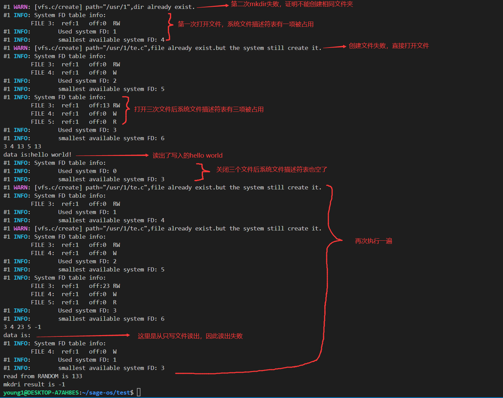

# 3.2 虚拟文件系统 vfs
## 3.2.1 概述
VFS是操作系统的文件系统虚拟层，在其下是实体的文件系统。虚拟文件系统的主要功用，在于让上层的软件，能够用单一的方式，来跟底层不同的文件系统沟通。在操作系统与之下的各种文件系统之间，虚拟文件系统提供了标准的操作接口，让操作系统能够很快的支持新的文件系统。简单来说，虚拟文件系统为系统提供了一个统一的文件接口，使得上层应用无需关心不同文件系统的操作，而是通过**同一方式**访问不同的文件系统。
### VFS要做些什么
在回答这个问题之前，我想先引用一句富有哲理的话：**_万丈高楼平地起_** 。我们现在已经知道VFS的目的是为不同的文件系统（或者可以说是设备）提供统一的接口。那么想要知道VFS要做些什么就要知道这些设备都做了什么。
###  底层设备
幸运的是，在我们所使用的环境中，与底层设备打交道已经被极大的简化，各个设备可以看成一个个可以随机存取的数组，这极大的简化了与底层设备打交道所需要的代码量。在这里我们简单介绍几个频繁打交道的设备。
#### 磁盘
我们所有的持久性数据，可以说都是存储在磁盘上。关于该文件系统的实现，已经在 _3.1.1_ 中做了详细阐述。此时如果一个进程想访问这个文件系统内的资源，就需要提供它要访问的路径。通过对路径的解析，VFS得知了该资源位于磁盘设备上，接下来要做的事就是调用磁盘文件系统的 ``read``，``write`` 等一系列接口即可。
#### 字符终端
字符终端是一个显示设备。它只提供简单的 ``read`` 和 ``write`` ，功能是从终端读取输入和显示输出。很显然字符终端不提供任何其他操作，如``open``,``close``等。那么相应的，在VFS实现时要屏蔽对该设备的这些操作。

### 抽象

整个 VFS 的目录结构抽象如下所示：


- `/`：根目录上挂载了实际的文件系统
- `/proc` ：该抽象目录对外提供对进程信息的访问
- `/dev`：该设备抽象目录提供对若干设备的抽象，包括：
  - `/dev/null` 可读写：读取总是返回 EOF，写入总是丢弃
  - `/dev/zero` 只读：总是返回 0
  - `/dev/random` 只读：返回一个 0~256 之间的随机数
  - `/dev/input` 只读：读取一个键盘键入事件
  - `/dev/video` 读写：对GPU（软件模拟的2D图形加速模块）进行操作

## 3.2.2 VFS实现

通过对不同设备的简要了解，我们大致知道了VFS要做些什么：**判断操作进行在哪一个文件系统，将统一格式的操作转化为各个设备能接受的操作并屏蔽那些设备不支持的操作**。重要的一点是要知道操作在哪一个文件系统。进程提供路径，VFS来判断属于哪一文件系统，再执行对应操作。那么这里就涉及到了另一个关键点：**路径解析**。关于路径解析的部分,已经在 _3.1_ 节中所介绍。现在我们只需要知道，VFS帮我们获得了这一重要信息。那么接下来要做的事情就是 `` if else `` 了。

当然，为了避免大量的 ``if else ``, 我们使用了AM提供的 ``MODULE`` 这一宏定义，使得可以像面向对象那样使用不同的文件系统“对象”来对其进行操作。这里的细节就不继续讨论了，只需要知道，文件系统被抽象成了拥有同一父类的对象即可。

### VFS接口

VFS 提供了如下的抽象接口，其定义与 UNIX 规定的标准行为一致：

```c
MODULE(vfs) {
  void (*init)();
  int (*write)(int fd, void *buf, int count);
  int (*read)(int fd, void *buf, int count);
  int (*close)(int fd);
  int (*open)(const char *pathname, int flags);
  int (*lseek)(int fd, int offset, int whence);
  int (*link)(const char *oldpath, const char *newpath);
  int (*unlink)(const char *pathname);
  int (*fstat)(int fd, struct ufs_stat *buf);
  int (*mkdir)(const char *pathname);
  int (*chdir)(const char *path);
  int (*dup)(int fd);
};
```

## 3.2.3 演示结果

在VFS演示程序中，我们创建了一个进程。该进程的目录为根目录。该进程所做工作如下：
- 在当前目录创建 ``usr`` 文件夹
- 在根目录下创建**两次** ``/usr/1`` 文件夹
- 进程调用 ``open`` 打开文件 ``/usr/1/te.c`` ,打开方式为创建和**可读写**
- 打印系统文件描述符表中的文件项
- 进程调用 ``open`` 再次打开文件 ``/usr/1/te.c`` ,打开方式为创建和**只写**
- 打印系统文件描述符表中的文件项
- 向**可读写**方式打开的 ``/usr/1/te.c`` 文件中写入 ``hello world!``
- 进程调用 ``open`` 再次打开文件 ``/usr/1/te.c`` ,打开方式为创建和**只读**
- 进程调用 ``lseek`` 重置**可读写**方式打开的文件的指针
- 读出**可读写**方式打开的文件的内容并打印
- 关闭三个已打开文件
- 重复执行一遍上述操作，但不用 ``lseek`` 而是读出**只读**方式打开的文件的内容并打印
- 测试其他设备读写

### 结果



