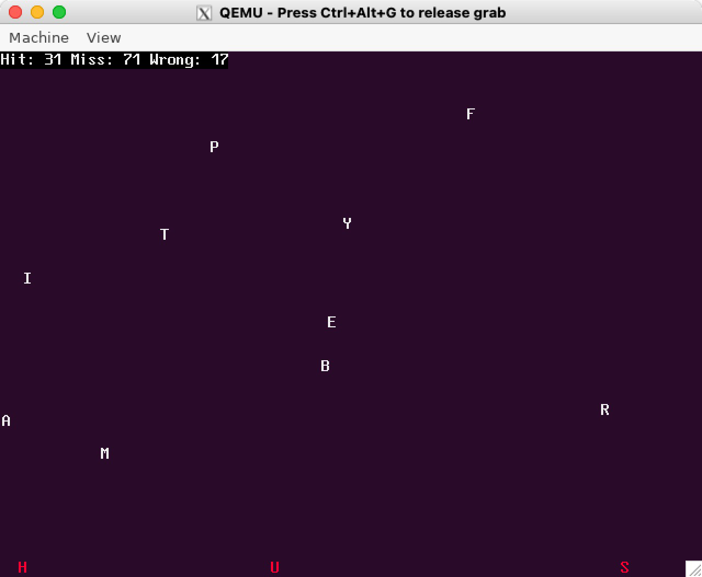

# 4.2 type game

## 4.2.1 概述

Type Game 是一个运行在 SageOS 的线程上的游戏，移植自其它开源项目。我们将它进行了移植，让它成功跑在了 SageOS 的线程中，并完全使用我们自己开发的接口运行。

游戏截图：

在游戏中，将会有随机的英文字母从屏幕上方坠落。用户需要敲击键盘，若输入成功，则该字母变绿，并飞向屏幕顶端；若某个字母来不及输入就到达了屏幕底端，则会变为红色。

## 4.2.2 移植说明

该程序原本是使用原生的 Abstract Machine 接口运行在裸机之上（无操作系统环境）。我们对它的移植包括：

- 使用我们自行开发的 PMM 模块提供大内存分配；

- 整个游戏运行在线程上，接收操作系统中断调度管理，并可退出至终端；

- 使用 devices 模块中的 input 模块接口，从键盘事件队列监听输入事件并处理；

- 使用 devices 模块中的 video 模块接口，将原来的渲染函数改写为 Spirite 及 Texture 方法，实现了软件模拟的 2D 加速。

  
