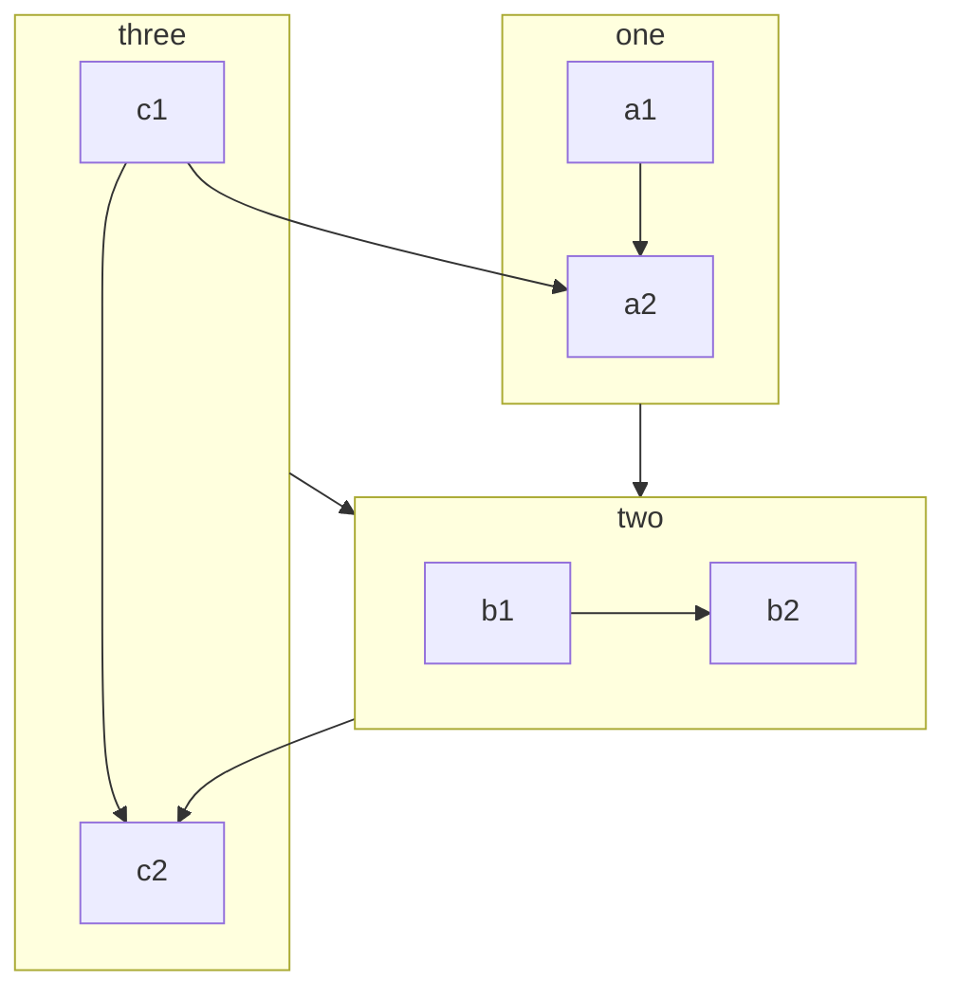

# Markdown 内容演示

## 基本使用

### 文本

**加粗**

_倾斜_

==高亮==

### 引用

> 引用
>
> 这是一个 quote

### container

以下是一些 [container](https://github.com/markdown-it/markdown-it-container)：

::: tip 提示
This is a tip
:::

::: warning 警告
This is a warning
:::

::: danger 危险
This is a dangerous warning
:::

这是一个可以展开的框框：
::: details 这里是标题
This is a details block, which does not work in IE / Edge
:::

### 公式

公式：$a+b=c$

$$
\lim^\infty_{k=0}\frac{1}{x^i}
$$

### 上下角标

19^th^ H~2~O

- [查看详情](https://vuepress-theme-hope.github.io/v2/zh/guide/markdown/sup-sub.html)

### 脚注

此文字有脚注[^first].

[^first]: 这是脚注内容

- [查看详情](https://vuepress-theme-hope.github.io/v2/zh/guide/markdown/footnote.html)

### 标记

你可以标记 ==重要的内容== 。

- [查看详情](https://vuepress-theme-hope.github.io/v2/zh/guide/markdown/mark.html)

### 任务列表

- [x] 计划 1
- [ ] 计划 2

- [查看详情](https://vuepress-theme-hope.github.io/v2/zh/guide/markdown/tasklist.html)

### 代码高亮

```c
printf("hello");
if (condition)
    // comment
    halt();
```

## 进阶使用

### 图表

::: chart 一个散点图案例

```json
{
  "type": "scatter",
  "data": {
    "datasets": [
      {
        "label": "散点数据集",
        "data": [
          { "x": -10, "y": 0 },
          { "x": 0, "y": 10 },
          { "x": 10, "y": 5 },
          { "x": 0.5, "y": 5.5 }
        ],
        "backgroundColor": "rgb(255, 99, 132)"
      }
    ]
  },
  "options": {
    "scales": {
      "x": {
        "type": "linear",
        "position": "bottom"
      }
    }
  }
}
```

:::

- [查看详情](https://vuepress-theme-hope.github.io/v2/zh/guide/markdown/chart.html)

### 流程图

```flow
cond=>condition: 是否执行操作?
process=>operation: 操作
e=>end: 结束

cond(yes)->process->e
cond(no)->e
```

- [查看详情](https://vuepress-theme-hope.github.io/v2/zh/guide/markdown/flowchart.html)

### Mermaid



- [查看详情](https://vuepress-theme-hope.github.io/v2/zh/guide/markdown/mermaid.html)
