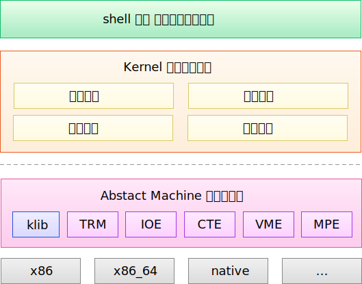
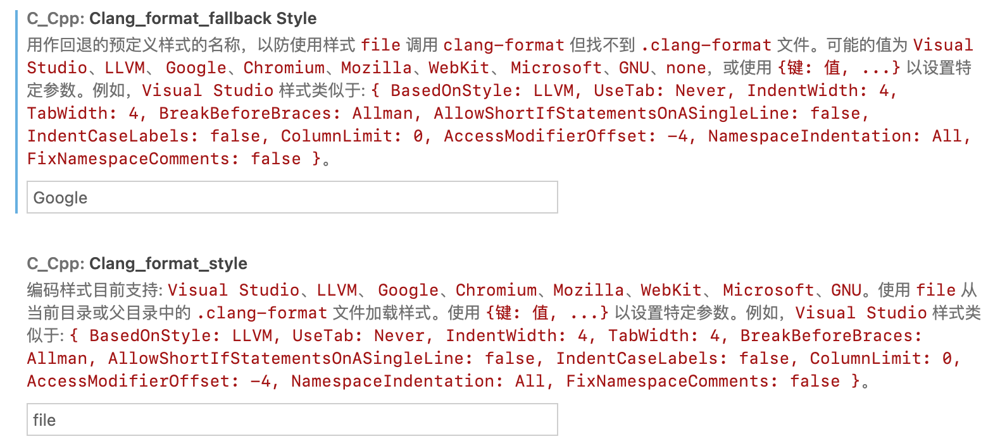
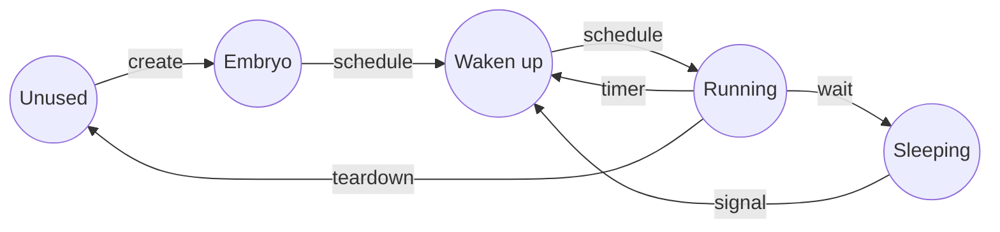

进程

# 0. SageOS 概述

SageOS 是一个 **多处理器**、**分时**、**多任务** 的现代操作系统。它的特点如下：

- 基于 Abstract Machine 硬件抽象层构建，具有跨体系结构运行的可能性
- 使用 x86_64 QEMU 模拟运行，能够在各种主流宿主操作系统上运行
- 小而精的 kernel 实现，涵盖内存管理、进程管理、系统调度以及文件系统等模块

Sage 意为 “智慧” 或 “鼠尾草”。我们希望能完成一些富有创造力的工作，最终达成操作系统的学习目标。

## 0.1 系统结构

### 0.1.1 系统模块

我们希望 SageOS 既能够拥有真正的操作系统特性，又不必过多地考虑体系结构相关的内容。因此，我们决定选用 Abstract Machine (以下简称 AM) 作为 SageOS 的硬件抽象层。

AM 为 SageOS 提供了 `arch-specific` 的抽象接口。通过使用 AM 提供的 API，我们能够专心于操作系统的部分。

SageOS 包括以下模块或内容：

| 名称     | 说明                                                                                               |
| :------- | -------------------------------------------------------------------------------------------------- |
| 内存管理 | 分配和回收物理内存、管理虚拟页表和进程虚拟内存                                                     |
| 进程管理 | 创建、回收和运行进程或线程，能够在用户态和内核态之间跳转                                           |
| 中断处理 | 处理各种中断事件，提供进程的休眠/唤醒机制                                                          |
| 系统调度 | 选用合适的调度算法，为进程分配 CPU 时间片                                                          |
| 文件管理 | 实现 inode 类型的文件系统；<br />实现虚拟文件系统上的统一接口，可供访问文件、进程 procfs、sda 设备 |

### 0.1.2 系统架构

整个 SageOS 的架构图如下：



其中，虚线上方加上 klib 为我们自行开发的内容，虚线下方除去 klib 后的属于 Abstrac Machine 的范畴。

整个系统自底向上依次是：

- 硬件体系结构层

  - 这一层中，与机器相关的的体系结构（例如 x86_64）向上提供接口
  - Abstract Machine 负责与具体的体系结构打交道，向上屏蔽了特定硬件架构的接口细节

- Abstract Machine 硬件抽象层。这一层提供了如下模块：
  - `TRM` : Turing Machine
  - `IOE` : Input/Output Devices
  - `CTE` : Interrupt Handling and Context Switching
  - `VME` : Virtual Memory
  - `MPE` : Multi-Processing
  - `klib` : 实现部分 C 库函数
- Kernel 操作系统内核层。这一层是整个系统的核心：

  - kernel 借助下层的硬件抽象接口，完成了整个操作系统的各个功能模块
  - 同时，kernel 向上为用户程序提供操作系统接口

- Shell 以及其它用户程序
  - shell 运行起来的样子，就是操作系统最终启动时“看起来”的样子！
  - 还有许多用户程序可以运行在操作系统上。

当然，以上只是一个大概的框架。除此之外，SageOS 还能够管理各类 IO 设备，比如 tty 终端、显示设备（显存）、串口输入等。这一部分的功能实现并非由我们实现，而是移植了第三方代码。[^1 移植自南京大学操作系统实验]

### 0.1.3 展望

基于操作系统提供的服务，我们最终应当能够实现这样的效果：

- 能够预编译用户程序为可执行文件，并存放在文件系统镜像中；
- 能够使用 shell 在 tty 设备上直接输入命令，动态加载可执行文件，运行用户进程；
- 借助中断处理，操作系统能够自由地调度和切换各个用户进程。

[^1]: 移植自南京大学操作系统实验

## 0.2 开发与运行指南

本节主要介绍如何开发、编译与运行 SageOS。

### 0.2.1 开发环境说明

#### 开发宿主操作系统

目前，选用的开发宿主操作系统为 Ubuntu 20.04 LTS. 这是为了方便使用 Windows 提供的 WSL 子系统。

事实上，SageOS 编译后的系统镜像能够在 Windows 以及各种 Linux 发行版（包括麒麟操作系统）上借助 QEMU 运行。

#### 开发语言和环境

SageOS 采用纯 C 语言编写，使用 gcc 9.4.0 以及 C11 标准进行编译。

为了便于开发和调试，我们还选用了 Visual Studio Code 作为编辑器和调试器。

### 0.2.2 目录结构

源代码目录的结构说明如下：

```
.
├── abstract-machine
│   ├── am              ## Abstract Machine 相关代码
│   └── klib            ## klib 实现
│
├── docs                ## 项目文档和 Doxygen 生成目录
│
├── kernel              ## kernel 源代码
│   ├── framework
│   ├── include
│   └── src
│
└── test                ## 测试框架（演示项目及单元测试）
    ├── include
    └── units
```

### 0.2.3 配置开发环境

本小节介绍如何在 0.2.1 节所述的开发系统和软件上配置开发环境。

#### 安装包

```shell
sudo apt update
sudo apt upgrade
sudo apt install build-essential
sudo apt install gcc-multilib
sudo apt install gdb
sudo apt install qemu
sudo apt install qemu-user
sudo apt install qemu-system-x86
sudo apt install qemu-utils
```

#### 配置图形界面

为了显示界面，需要使用 X11 转发。

使用 X11 的前提是配置好 ssh 密钥，这可以通过 `ssh-keygen` 进行生成。生成后的公钥文件可使用 `ssh-copy-id` 命令设置到目标主机上。

- 对于 WSL2, 其自带的 WSLg 无需配置
- 对于 ssh 连接，添加 -X 标记即可转发图形界面

另外，需要安装 XQuartz 或者 Xming 作为 X11 Server 进行转发。

### 0.2.4 编译与运行

SageOS 通过 Make 程序编译系统镜像。

可通过如下命令编译并运行 kernel:

```shell
cd kernel
make run
```

如果以上命令失败，请确认依赖项是否已经安装、X11 是否配置成功。此外，WSL 子系统如果报错信息与 init 进程（PID 1）相关，则需要执行如下命令：

```shell
sudo -b unshare --pid --fork --mount-proc /lib/systemd/systemd --system-unit=basic.target
sudo -E nsenter --all -t $(pgrep -xo systemd) runuser -P -l $USER -c "exec $SHELL"
```

若要运行编译后的镜像，可以执行如下命令：

```shell
qemu-system-x86_64 -serial mon:stdio -drive format=raw,file=kernel/build/kernel-x86_64-qemu
```

### 0.2.5 调试

如果使用命令行 gdb 进行调试，可以运行：

```shell
cd kernel
make
qemu-system-x86_64 -s -S -serial mon:stdio -drive format=raw,file=kernel/build/kernel-x86_64-qemu  &
pid=$!
gdb \
  -ex "target remote localhost:1234" \
  -ex "set confirm off"
```

此外，项目的 `.vscode` 文件夹中提供了在 vscode 中使用图形界面进行调试的配置。

首先，需要安装 Command Variable 插件；

其次，需复制 `.vscode/*.json.template` 并更名为 `*.json` 。之后，可以选择特定的调试配置运行。

## 0.3 测试与演示

### 0.3.1 测试框架介绍

如果只能通过单一的方式打包 kernel 镜像并进行调试，无疑会非常麻烦，因为这需要频繁修改入口代码。此外，操作系统是一个复杂的整体，开发操作系统需要确保每个子模块的正确性。

为了便于单独测试各个模块的正确性，我们设计了一个简易的测试框架，也就是 `test` 目录。

测试框架支持以下功能：

- 一键回归测试
- 编译/运行单个单元测试
- 调试单个单元测试（native 和 x86_64-qemu）
- 运行测试作为演示

#### 目录结构说明

`test` 目录内容如下：

```
test
├── build       ## 存放编译后的可执行文件
├── out         ## 存放测试输出（stdout重定向）
├── include     ## 存放头文件
└── units       ## 存放单元测试的 .c 文件
```

### 0.3.2 使用测试框架开发测试或演示

#### 编写单元测试

`units` 下可以有两种文件：

- `test_` 开头的 c 程序将被视作自动化测试，要求不能陷入死循环
- 其他程序将用于运行和展示，可以死循环

你可以参考 `test_add.c` 文件，使用数组对多种输入输出进行判断。

在编写时，如果你的测试比较庞大，建议使用 `logger` 而不是 `printf` 打印结果。

#### 环境变量

你可以直接执行 `export` 定义环境变量，也可以在 make 命令中加入环境变量。建议使用前者，例如：

```shell
export smp=4
export LOG_MASK=15
```

可配置的环境变量有：

- `ARCH` : 当前支持 `native` 和 `x86_64-qemu` , 若 ARCH 不指定，则默认为 `x86_64-qemu` .
- `smp` : 处理器数量，默认为 2
- `CFLAGS_EXTRA` : gcc 编译时的额外选项，默认为空。例如 `"-DSIMULATE_PMM"` （已默认加上 `-DTEST` 和 `-DLOG_MASK=xxx` ）
- `LOG_MASK` : logger 输出 mask, 详见 logger.h. 默认输出 error(8), warn(4), info(2), 也就是说默认值为 14. 如果你要输出 success(1)，设置为 15 即可

#### 运行测试

**运行全部测试：**

```shell
make test
```

如果出现错误，可以查看 `out` 文件夹内的输出内容。

**运行单个测试：**

```shell
make run target=xxx
```

必须要指定 `target=xxx` ，其中 `xxx` 是在 `units` 目录下的文件名（没有 .c 后缀）。

**调试单个测试：**

为了便于调试单个测试，编写了 vscode 的相应调试配置，你只需要把 `.vscode` 目录下的模板文件复制一份（注意不要删除或直接改名）并更名为 `launch.json` 和 `tasks.json` 即可使用。

如果你要调试 native，在对应单元测试文件上直接调试，配置选择 `unit test (native)` 即可。

如果你要调试 QEMU，运行如下命令：

```shell
make debug target=xxx
```

并在对应单元测试文件运行调试配置 `unit test (QEMU)` 即可。

**清除编译文件**

```shell
make clean
```

### 0.3.3 测试框架原理说明

下面以 `make test` 为例，说明当你运行回归测试时发生了什么事情：

1. GNU make 程序读取 `test/Makefile` 文件并执行 `run` target；
2. Make 将会扫描 `units` 下的每一个 .c 文件，并为它生成对应的 `Makefile.xxx` ；
3. 接着，脚本将会自动运行 `make -f Makefile.xxx` ，进行编译并运行（编译时会链接 AM 和 kernel）；
4. main() 函数将会被执行，程序的输出将重定向到 `out/xxx.out` 目录中，脚本将会检查运行是否成功：
   - 如果是 `native` 架构，直接检查返回值
   - 如果是 `x86-64_qemu` 架构，将会检查 `out/xxx.out` 中 CPU 的 halt 返回值
     如返回值为非 0, 则代表该项测试失败。
5. 打印出最终测试结果。

### 0.3.4 其它问题和注意事项

1. 如果更改代码后运行结果还是出错，请 `make clean` ；若清除后仍出现错误的文件链接或使用了此前的编译文件，请删除项目内所有 build 目录（包括 am/klib/kernel 等目录下的 build 目录）并重试。

2. 运行在 `native` 架构时，将不会链接 `klib` ，而是使用标准库函数。

3. 调试时若出现与 signal 有关的错误，请检查 launch.json 配置是否正常。如果用 gdb 命令行，需要执行 `handle SIGUSR1 SIGUSR2 SIGSEGV noprint nostop` .

4. 编译单元测试链接 `kernel` 时，将不会编译 `kernel/framework/main.c` 文件，这使得单元测试内的 main 函数可以被执行。

5. 如果不希望链接 `kernel` ，可以添加 `NOKERNEL=true` 选项到命令中。

6. 编译单元测试时将会 define TEST 标志。如果需要在测试框架以外写测试逻辑，可以借助 `#ifdef TEST` 实现。 `os_run` 函数使用了这个方法。

## 0.4 开发与协作

### 0.4.1 分组开发规划

整体上，将 SageOS 分为三大模块以及其它程序或库，共四部分。由于四部分之间存在相互依赖关系，无法进行同时开发，故将四部分的开发组编号为 1、2、3、4 组，分别负责如下：

- 1 组：内存管理模块（2 人）
  - 物理内存管理
  - 页表、虚拟内存管理
- 2 组：进程/线程管理模块（4 人）
  - 进程管理
  - 系统中断、上下文切换和调度算法
- 3 组：文件系统
- 4 组：基础功能、外围应用等
  - `4a-klib` 组：实现 stdio.c 以及 string.c 中的部分库函数（2 人）
  - `4b-shell` 组：实现交互式 shell，功能包括部分系统指令、运行用户程序、输入和输出重定向（1 人）
  - `4c-apps` 组：实现其它用户程序

从时间上看，各组的开发为“流水线”式开发。通常在上一组尚未开始时下一组并不能开始；当上一组完成部分工作后，例如完成一些数据结构或接口等设计后，下一组则可以开始工作。

### 0.4.2 git 协作流程

我们使用 git 进行版本管理、分支管理和协作开发。本节说明如何使用 git 进行协作。

#### git 分支结构说明

我们设计了如下的分支结构：

- `branch:dev` 为默认分支（主分支）
- `branch:dev-{#}-{description}` 为每个组的开发分支。如 `dev-4a-klib` 表示 4a 开发组所用分支。
- `branch:fix-{#}-xxx` 为修复 bugs 所用的临时分支。
- `branch:archived` 为归档分支，此分支只可向外签出，不能修改。如果遇到了 PR 混乱的情况，需要将此版本的最新 commit 签出。

#### 协作流程

以下阐述使用 git 进行开发协作的具体过程。

##### 初始化

当 sage-os 的远端仓库准备好后，将会向成员发送协作邀请，请前往邮箱进行确认。确认完毕后，成员需要：

1. 把仓库 fork 到自己的账号中；

2. 将 fork 后的仓库（在你自己的账户名下）clone 到本地：

   ```bash
   git clone git@github.com:xiaomin/sage-os.git
   ```

3. 运行 `git branch -a` 查看自己的分支，并切换到你对应的分支.

4. 设置 upstream 为远端仓库：

   ```bash
   git remote -v ## 如果有upstream后不需要后续操作
   git remote add upstream git@github.com:moeakwak/sage-os.git
   ```

##### 准备阶段

1. 小组成员之间进行研讨，确定模块架构和功能组成

2. 进行 API 设计（头文件+注释文档），并按流程提交 Pull Request (PR)。以下为负责人相关操作：

   - 开发组立项：在远端仓库建立 `dev-{#}-{description}` 分支

   - 提交 issue（API 设计）

   - 在自己 fork 的仓库 fetch upstream，checkout 到该分支；在该分支上操作并完成 API 设计，且依照 doxygen 注释格式完成简要的注释

   - 提交 PR 申请

架构相关 PR 提交后，除本组成员之外，需要至少课设组长以及 1 名组外成员进行代码审核 (code review) 方可通过，并 merge 到 dev 分支.

##### 开发阶段

1. 开发组成员应当在 fork 仓库上拉取远端仓库的开发分支

   ```bash
   git fetch upstream
   git checkout <分支名称>
   ```

2. 完成你的功能开发后，就可以提交 PR 了. 提交后的代码，需交由同开发组的其他成员以及至少 1 名组外成员 review。审核完毕后，将会进行 merge 操作。

如果在开发的过程中，有其他部分的代码更新，需要 pull upstream 以同步其他人的代码。

### 0.4.3 代码风格

为统一代码风格，我们使用 `clang-format` 软件进行自动格式化，其配置文件位于项目目录下的 `.clang-format` 。

代码风格包括使用小写字母和下划线命名符号、函数括号不换行、多行连续赋值自动对齐等。

首先需要安装该软件：

```shell
sudo apt install clang-format
```

之后，应当在 VSCode 中完成如下设置：

1. 确保格式化引擎为 `clangFormat` :

   

2. 设置 `format_style` 如下

   

3. 设置自动格式化（或使用快捷键 `Ctrl+Shift+F` 进行格式化）

   

### 0.4.4 注释和文档

为统一注释，SageOS 采用 Doxygen 风格的注释。例如：

```c
/**
 * @brief write bytes (including '\0')
 *
 * @param out output stream
 * @param fmt input format
 * @param ap variable list
 * @return int nums of characters
 */
int vsprintf(char *out, const char *fmt, va_list ap) {
  int ret = vsnprintf(out, INT32_MAX, fmt, ap);
  return ret;
}
```

此外，我们配置了 Doxygen 文档生成程序，它会根据代码中的注释自动创建 API 文档。

最终，项目包括两部分文档：

- 由 Doxygen 自动生成的文档
- 手动撰写的说明性文档

进程

# 1. 内存管理

目前，内存管理主要是管理 `heap_start` 到 `heap_end` 的一块物理内存区域。如图所示：

```
      heap_end<---+--------------+
                  |   metadata   +--->pool&chunk(pages),etc.
    meta_start<---+--------------+      (for kernel)
                  |              |
                  |              |
                  |              |
                  |     free     |
                  |    spaces    |
                  |  (for user)  |
                  |              |
                  |              |
    heap_start<---+--------------+
```

我们将物理内存划分为页面，并在堆区的末尾存放物理页面管理的元数据。

下面将详细介绍内存管理模块的实现。

## 1.1 物理内存管理

物理内存管理模块（pmm）提供物理内存的分配与释放功能：

```c
void* kalloc(size_t size);
void kfree(void* ptr);
```

采取何种分配算法，才能让内存分配拥有较高的效率，并能够减少碎片？我们经过研究和讨论，决定采用伙伴系统 + SLAB 分配器的方法。

### 1.1.1 伙伴系统

#### 概述

为了方便管理内存，避免产生大量的内存碎片，需要一个内存管理系统来维护内存分配的过程；另一方面，过于详细内存分配管理系统也会占用过大的内存空间。如果每一个内存单元对应一个管理单元，则内存空间会浪费一半。

综上，伙伴系统和 slab 分配器结合的物理内存管理也随之产生。

#### 基本数据结构

以下是一个“块” (chunk) 的数据结构：

```c
struct chunk {
  struct list_head node;
  uint8_t order;
  bool used;
  void* slab;
};
```

#### 接口说明

```c
// 内存块到起始地址转换
void* chunk2virt(struct pmm_pool* mm_pool, struct chunk* chunk);
// 起始地址到内存块转换
struct chunk* virt2chunk(struct pmm_pool* mm_pool, void* virt);
// 合并伙伴块
struct chunk* chunk_merge(struct pmm_pool* mm_pool, struct chunk* chunk);
// 将内存块分解至指定秩
struct chunk* chunk_split(struct pmm_pool* mm_pool, uint8_t order,
                          struct chunk* chunk);
// 向空闲队列中添加块
void chunk_append(struct pmm_pool* mm_pool, struct chunk* chunk);
// 从空闲队列中删除块
void chunk_del(struct pmm_pool* mm_pool, struct chunk* chunk);
// 分配内存块
struct chunk* chunk_alloc(struct pmm_pool* mm_pool, uint8_t order);
// 释放内存块
void chunk_free(struct pmm_pool* mm_pool, struct chunk* chunk);
// 初始化伙伴系统
void buddy_init(struct pmm_pool* mm_pool, struct chunk* start_chunk,
                void* start_addr, uint64_t page_num);å
// 获取伙伴块
struct chunk* get_buddy_chunk(struct pmm_pool* mm_pool, struct chunk* chunk);
```

#### 设计思路

伙伴系统巧妙的将地址的二进制表示法和线段树的二分性进行了巧妙的结合，系统的基本数据结构是 `struct chunk` ，后面都会简称为 `块` ，它维护着$2^{order}$个页。当一个大小的内存请求到来时，首先计算满足条件的最小秩为多少，然后向伙伴系统申请相应秩的内存块。

伙伴系统中维护着一个分级队列，即对应着块的秩。首先系统会检查申请秩的队列，如果有空闲则直接分配；如果没有则进行向上查找，直到找到可用块，随后将其不断二分，直到分离到需要的秩。然后通过内存转换得到对应的其实物理地址。

当回收内存时，递归合并伙伴块，直到所对应伙伴块已经被分配或无伙伴块。

##### 分配内存时的流程

```flow
st=>start: 接收到分配请求
ed=>end: 返回分配地址
op1=>operation: 计算最小秩
cond1=>condition: 空闲列表中是否有所需的块
op1.1.1=>operation: 直接分配
op1.1.2=>operation: 将该块从空闲列表中删除
op3=>operation: 通过块地址计算分配地址
op1.2.1=>operation: 向上查找可用块
cond1.2=>condition: 是否有可用块
ed2=>end: 返回空指针
op1.2.2.1=>operation: 将可用块递归分裂，至所需秩
op1.2.2.2=>operation: 将每次分裂的另一半加入空闲队列

st->op1->cond1
cond1(yes)->op1.1.1->op1.1.2->op3
cond1(no)->op1.2.1->cond1.2
cond1.2(yes)->op1.2.2.1->op1.2.2.2(left)->op3
cond1.2(no)->ed2
op3->ed
```

##### 释放内存时的流程

```flow
st=>start: 接收到释放请求
op1=>operation: 将指针转换为块的地址
op2=>operation: 递归合并伙伴块
op3=>operation: 将块加入空闲队列
ed=>end: 释放成功

st->op1->op2->op3->ed
```

#### 设计细节

##### 堆区的构造

如图所示：

```
      heap_end<---+--------------+
                  |   metadata   +--->pool&chunk(pages),etc.
    meta_start<---+--------------+      (for kernel)
                  |              |
                  |              |
                  |              |
                  |     free     |
                  |    spaces    |
                  |  (for user)  |
                  |              |
                  |              |
    heap_start<---+--------------+
```

##### 内存池设计

为了方便管理元数据，我们设计了内存池。结构如下：

```c
struct pmm_pool {
  uint64_t begin_addr;
  uint64_t page_num;
  uint64_t size;
  struct chunk* chunk_metadata;
  struct free_list free_lists[BUDDY_MAX_ORDER];
};
```

其中包括了堆区地址 `begin_addr` ，页数，总大小，块元数据起始地址 `chunk_metadata` ，以及空闲链表（链表设计见[ `list.h` 设计说明](../4.apps/4.3-list.md)）。

##### 元数据初始化

1. 页面数量

   遵循着我们对堆区分配的设计，一个页对应着一块元数据，在已知堆区的起始地址和终止地址后，我们可以如下计算出页面数量。

   ```c
   nr_page =
         (uint64_t)(heap.end - heap.start) / (SZ_PAGE + sizeof(struct chunk));
   ```

2. 起始地址

   堆区起始地址只需要调用 `abstract machine` 的接口 `Area heap` 即可，而元数据起始地址的计算就是堆区起始地址偏移 `SZ_PAGE * nr_page` 即可。

   ```c
   pg_start = heap.start;
   pi_start = (bool*)(pg_start + nr_page * SZ_PAGE);
   ```

3. 空闲块初始化

   现在在内存池中已经有了 `nr_page` 个秩为 0 的内存块，现在对这些内存块遍历：如果该内存块的伙伴块在空闲队列中，则重复进行合并操作，并将最后的内存块加入空闲队列；如果不在空闲队列中，则直接加入空闲队列。

   

##### 获取伙伴块

在考虑这个问题之前，我们需要对内存地址有一定的了解。

我们有伙伴系统的前提是，分配的空间在地址逻辑上是连续的。这样我们才有了如下的内存地址格式。

```
    +---------------------------------+-------------------+
    |            base addr            |      offset       |
    +---------------------------------+-------------------+
    |                                                     |
    |<-----------------------64bits---------------------->|
    |                                                     |
```

而对于 `offset=0` 的内存块来说，大小为 4 个内存单元时，下一个内存块就应该是 `offset=4` 而此时二进制表示法为 `0x0100` 。所以我们有一个假说，即我们获取对应块的内存地址的公式为${address}\oplus(1 << (order+log_2({pagesize})))$。因为二进制的特殊性，我们可以无进位加法和减法没有区别，都可以使用异或进行运算。

##### 块地址与起始内存地址转换算法

我们假定单元内存块都分配着一个页，这样的话第 n 个内存块对应着第 n 个内存单元页，而无论对应块的 order 为多少，它所对应的起始内存地址都不会改变。由此可以易得，地址转换的公式为 `(chunk - chunk_metadata) * SZ_PAGE + begin_addr` ，反之亦然。

伙伴算法具有以下一些缺点：

- 一个很小的块往往会阻碍一个大块的合并，一个系统中，对内存块的分配，大小是随机的，一片内存中仅一个小的内存块没有释放，旁边两个大的就不能合并。

- 算法中有一定的浪费现象，伙伴算法是按 2 的幂次方大小进行分配内存块，当然这样做是有原因的，即为了避免把大的内存块拆的太碎，更重要的是使分配和释放过程迅速。但是他也带来了不利的一面，如果所需内存大小不是 2 的幂次方，就会有部分页面浪费。有时还很严重。比如原来是 1024 个块，申请了 16 个块，再申请 600 个块就申请不到了，因为已经被分割了。
- 另外拆分和合并涉及到 较多的链表和位图操作，开销还是比较大的。

### 1.1.2 SLAB 分配器

#### 概述

伙伴算法采用页框作为基本内存区，适合于大块内存请求，而当进行小片内存分配的申请时，就会产生内部碎片，造成内存的浪费。为满足进程或者系统对小片内存的请求，对内存管理粒度更小的 SLAB 分配器就产生了。

#### 接口说明

```c
//初始化slab分配器
void slab_init(void);

//对slab分配器内不同粒度的小内存进行初始化
static slab_header_t *init_slab_cache(int order, int size);

//向伙伴系统申请指定大小的内存并标为slab使用
static void *alloc_slab_memory(u64 size);

//向slab申请内存
void *alloc_in_slab(u64 size);
static void *_alloc_in_slab(slab_header_t *slab_header, int order);

//单核无并发下的slab内存分配
static void *_alloc_in_slab_nolock(slab_header_t * slab_header, int order);

//slab释放内存
void free_in_slab(void *addr)
```

#### 设计思路

slab 分配器是在 buddy system 的基础之上运行的，分配器为不同粒度的小内存块单独维护各自的队列。初始化时分配器为每个内存粒度向 buddy system 申请一定大小的内存块，并按照粒度将其分割成队列。

分配内存时首先定位到对应的粒度，然后遍历队列寻找可用内存块，若存在则将其返回，若已满则向 buddy system 申请一块新内存并从其中分配一块小内存块并返回，同时更新可用队列。

释放时定位到该内存块所属的 slab 并将该内存插入队列头供下次分配使用。

##### 分配内存时的流程

```flow
st=>start: 接收到分配请求
op1=>operation: 根据请求内存大小定位到相应粒度的slab
op2=>operation: 遍历slab，寻找可用slot
cond1=>condition: 存在可用slot
ed1=>end: 分配该slot
op3=>operation: 向buddy system申请内存，初始化为slab
op4=>operation: 更新slab队列
ed2=>end: 从该slab中分配slot

st->op1->op2->cond1
cond1(yes)->ed1
cond1(no)->op3->op4->ed2
```

##### 释放内存时的流程

```flow
st=>start: 接收到释放请求
op1=>operation: 定位到slab队列中的所属slab
op2=>operation: 将该内存对应的slot插入slot可用队列头
ed=>end: 结束

st->op1->op2->ed
```

#### 设计细节

##### slab 分配器的构造

slab 分配器有很多种，此处使用数组与链表相结合的形式，为不同大小的小内存申请分别维护一个内存链表。

```c
//slabs数组，存放不同大小的内存链表
slab_header_t *slabs[SLAB_MAX_ORDER + 1];

//针对特定大小的小片内存申请的内存链表
typedef struct slab_header slab_header_t;
struct slab_header {
	void *free_list_head;//链表头
	slab_header_t *next_slab;//链表用完时向buddy system申请新的slab
	int order;//该链表维护的内存块的大小
};

```

结构如图所示:

```
                                                                +----------------+
                                                                |    occupied    |
                                                                +----------------+
                                                                |      ...       |
                                                                +----------------+
   slabs<---+----------------+     |--->+----------------+      |    occupied    |
            |  slabs[0]=null +     |    | free_list_head |----->+----------------+
            +----------------+     |    +----------------+      |      free      |
            |  slabs[1]=null |     |    |   next_slab    |---|  +----------------+
            +----------------+     |    +----------------+   |  |      ...       |
            |       .        |     |    |     order      |   |  +----------------+
            |       .        |     |    +----------------+   |  |      free      |
            |       .        |     |                         |  +----------------+
            +--------------- +     |                         |  |      null      |
            |slabs[MIN_ORDER]|-----| |-----------------------|  +----------------+
            +----------------+       |                               slot_list
            |      ...       |       |->+----------------+
            +--------------- +          | free_list_head |-----
            |slabs[MAX_ORDER]|          +----------------+
            +----------------+          |   next_slab    |---
                                        +----------------+
                                        |     order      |
                                        +----------------+

```

##### slab 分配器的初始化

```c
//对数组内不同大小内存的链表进行初始化
for (order = SLAB_MIN_ORDER; order <= SLAB_MAX_ORDER; order++) {
		slabs[order] = init_slab_cache(order, SLAB_INIT_SIZE);
	}
```

##### 区分内存管理者的关键：chunk->slab

当调用 kfree()回收某个对象的内存时，会遇到这样的问题：无法确定该内存是由 buddy system 还是 slab allocator 进行维护的。此时 chunk 结构体中的 slab 能够起到分辨的作用，从而调用正确的回收机制。

回顾一下 chunk 结构体:

```c
struct chunk {
  struct list_head node;
  uint8_t order;
  bool used;
  void* slab;
};
```

调用 kfree()时，若一块 chunk 是从 buddy system 中分配的，则 slab 因未被赋值，所以值为 null，而若是属于 slab 的内存，则其值为该块内存的起始地址。如下所示：

```c
static void *alloc_slab_memory(u64 size)
{
	struct chunk *p_chunk, *chunk;
	void *addr;
	u64 order, chunk_num;
	void *chunk_addr;
	int i;
	order = size_to_order(size / SZ_PAGE);
	p_chunk = chunk_alloc(&global_mm_pool, order);
	addr = chunk2virt(&global_mm_pool, p_chunk);
	chunk_num = order_to_size(order);
	for (i = 0; i < chunk_num; i++) {
		chunk_addr = (void *)((u64) addr + i * SZ_PAGE);
		chunk = virt2chunk(&global_mm_pool, chunk_addr);
		chunk->slab = addr;//slab被赋值，不为null
	}
	return addr;
}
```

kfree()中，通过地址转换由起始内存地址得到块地址，进而判断该块的归属：

```c
static void kfree(void* ptr) {
  struct chunk* chunk = virt2chunk(&global_mm_pool, ptr);
  if (chunk && chunk->slab)//chunk->slab!=null,表明属于slab
    free_in_slab(ptr);
  else//否则属于buddy system
    chunk_free(&global_mm_pool, chunk);
}
```

##### 内存的分配与释放

分配：在 slab 中分配内存时，分配器首先通过请求的内存大小定位到 slabs 数组的相应位置 i，然后在 slabs[i]的当前 slab 中寻找可分配的 slot，若已分配完，则转向 next_slab 寻找，并一直找下去直到找到空闲 slot(则返回该 slot 给 kalloc)或到链表尾(slab[i]中无可用 slot)，无可用 slot 时则向 buddy system 请求一块新的 chunk，将其初始化为 slab 并置于链表头，然后从这块新的 slab 中分配 slot。

释放：释放内存时，首先通过地址转换得到该 slot 所属的 slab，然后将该 slot 置于 slab 的 free_list 链表头(即：当一个 slot 被分配后，其与前后 slot 的位置关系便不再被维护，而是在释放后将该 slot 直接放回原 slab)

```c
void free_in_slab(void *addr)
{
	struct chunk *chunk;
	slab_header_t *slab;
	slab_slot_list_t *slot;
	slot = (slab_slot_list_t *) addr;
	chunk = virt2chunk(&global_mm_pool, addr);//转换地址得到chunk
	slab = chunk->slab;//得到所属slab
	slot->next_free = slab->free_list_head;
	slab->free_list_head = slot;//释放的内存插入链表头
}
```

### 1.1.3 总体流程

#### 初始化

```flow
st=>start: 操作系统内核启动
op1=>operation: 内存管理系统启动
op2=>operation: 初始化buddy system
op3=>operation: 初始化slab分配器
ed=>end: ...

st->op1->op2->op3->ed
```

#### 分配

```flow
st=>start: kalloc(size)
e=>end: 返回地址
cond1=>condition: size<=最大的slot的大小
op1=>operation: alloc in slab
op2=>operation: alloc in buddy system

st->cond1
cond1(yes)->op1->e
cond1(no)->op2->e
```

#### 释放

```flow
st=>start: kfree(ptr)
e=>end: void
cond1=>condition: chunk->slab!=null
op1=>operation: free in slab
op2=>operation: free in buddy system
op3=>operation: 地址转换得到所属chunk

st->op3->cond1
cond1(yes)->op1->e
cond1(no)->op2->e
```

## 1.2 虚拟内存管理

页表、虚拟内存管理尚未实现。

进程

# 2. 进程管理、中断和调度

本章节描述进程管理模及相关内容（调度、中断）的实现。

## 2.1 自旋锁和信号量

### 2.1.1 自旋锁

#### 概述

自旋锁专为防止多处理器并发冲突而引入。自旋锁为实现保护共享资源提出了一种锁机制，在内核中大量应用于中断处理等部分。为了解决对某项资源的互斥使用，自旋锁在任何时刻最多只能有一个保持者，也就说，在任何时刻最多只能有一个执行单元获得锁。如果自旋锁已经被别的执行单元持有，调用者就一直循环等待该自旋锁。

#### 自旋锁数据结构

```c
int efif[MAX_CPU] = {}; //cpu中断信息栈的起始信息
int ncli[MAX_CPU] = {}; //cpu中断信息栈的高度（计数器）
struct spinlock {
  bool lock_flag;    // 锁状态标记，当为真时表示已上锁
  const char *name;  // 锁名，用于输出日志
  int hold_cpuid;    // 当前使用锁的cpu，用于输出日志
};
```

#### 接口说明

```c
//初始化一个自旋锁
void spin_init(spinlock_t *lk, const char *name);

//获得一个自旋锁
void spin_lock(spinlock_t *lk);

//释放一个自旋锁
void spin_unlock(spinlock_t *lk);

//返回当前cpu是否持有某个自旋锁
bool spin_holding(spinlock_t *lk);

//中断记录栈push功能
void spin_pushcli();

//中断记录栈pop功能
void spin_popcli();
```

#### 设计思路

基于自旋锁的机制，我们可以设计一个最简单的自旋锁：

```c
void spin_lock(spinlock_t *lk)
{
	while (if(lk->lock_flag!=0)) {
    ;
  }
  lk->lock_flag = 1;
}
```

每次循环原子性的判断该锁是否被上锁：

- 如果没有则占用，跳出循环
- 如果被占用则继续循环（自旋）  
  需要解锁时原子性的将该锁状态符置 0 即可

这样的锁存在十分严重的缺点，也就是运行效率偶尔会十分低下。这是由于内核态切换、异常等原因经常会陷入中断状态。如果占用某自旋锁的进程陷入中断状态，该自旋锁也会一直被该进程占用，直到解除中断，从而导致其他希望占用该锁的进程在中断期间也一直自旋，造成整个系统并发程度降低。

自旋锁一般用于保护共享内存（或参数）的少量指令工作，如对某个公共值的加减（此功能指令只有一行），所以我们可以在 cpu 每次申请锁时关闭该 cpu 的中断，释放锁的时候再开中断。

```c
void spin_lock(spinlock_t *lk)
{
	interrupt colse()；
	while (if(lk->lock_flag!=0)) {
    ;
  }
  lk->lock_flag = 1;
}
```

这样处理似乎正确了，但其实还有问题，当我们需要修改两个以上共享参数时：

```c
lock(a);
lock(b);
- - - - - -
unlock(b);  //open interrupt
unlock(a);
```

我们会在第一次 unlock 时就开中断而可能陷入中断，而使此优化失去意义，所以我们对每个 cpu 可以引入一个栈来存储放入了多少锁，通过 push 增加锁，pop 弹出锁。  
此外，当我们申请锁的时候可能中断本来就被关闭了，而在最后一次弹出锁开中断则会导致原程序出现问题，所以我们选择用栈底存储 cpu 第一次增加锁时，关中断的原状态，在最后一次弹出锁时还原状态。

##### 申请锁的流程

```flow
st=>start: 接到申请锁请求
ed=>end: 结束申请流程
push=>operation: 压入中断信息栈
读取当前中断开关状态 i
ncli=>condition: cpu->ncli == 0
ncliy=>operation: cpu->efif 设置为 i
ncliplus=>operation: 当前cpu的ncli加一
xchg=>condition: atomic_xchg
lkhold=>operation: 更改hold_cpuid为当前cpu

st->push->ncli
ncli(yes)->ncliy->ncliplus
ncli(no)->ncliplus
ncliplus(right)->xchg
xchg(yes)->lkhold->ed
xchg(no)->xchg
```

##### 释放锁的流程

```flow
st=>start: 接到释放锁请求
ed=>end: 结束释放流程
lkhold=>operation: hold_cpuid 设为 -1；
lock_flag 设为 false；
将当前锁弹出中断信息栈；
当前cpu的ncli计数器减一
checkefif=>condition: cpu.ncli == 0
&&
cpu.efif == 1
setefif=>operation: 开中断

st->lkhold->checkefif
checkefif(yes)->setefif->ed
checkefif(no)->ed
```

#### 设计细节

::: warning 警告
建议创建锁时使用 spin_init 函数初始化
:::
::: warning 警告
不建议在 `spin_lock(a)` 和 `spin_unlock(a)` 之间放置太多指令，中断关闭时间过长会出现问题，例如输入中断关闭过长会导致部分输入被吞
:::

##### 申请锁

我们 push 中断信息栈后，使用 `am` 提供的库函数 `atomic_xchg(int *addr, int newval) ` ，该库函数会原子性地监测 addr 是否不为 newval，并在不为 newval 的情况下改为 newval，并返回修改结果从而退出 while 循环。
::: danger 危险
注意自旋锁不能多次嵌套使用，如：

```
lock(a);
- - - - - -  //no unlock(a)
lock(a);
```

我们提供了 `spin_holding` 和申请时的 assert 检查这种情况，请在编写时注意
:::

##### 释放锁

我们使用 c++内联汇编函数 `asm volatile（）` 将锁状态置零后，pop 中断信息栈。

##### 监测持有人

我们提供了 `spin_holding（）` 接口可让当前进程判断是否持有该锁，assert 和内核常用该函数  
注意我们监测时需要关开中断，防止中断可能导致的问题

##### 中断信息栈

我们先建立一个中断栈示例，以 1 0 表示开中断 关中断：

```
    +---------------+
    |       0       |
    +---------------+
    |       0       |
    +---------------+
    |       0       |
    +---------------+
    |     1 / 0     | (栈底，记录最初的开关中断状态)
    +---------------+

```

观察发现我们其实并不需要一个栈，只需要一个计数器 ncli 去维护该 cpu 里含有多少锁（此计数器同时保证我们不需要按申请锁顺序释放锁）和一个 efif 去记录最初开关中断状态即可。  
所以我们最后使用一个计数器（ncli）组和 efif 组记录不同 cpu 的简化中断信息栈信息。  
使用 qemu 提供的库函数 `iset()` 开关中断

### 2.1.2 信号量

#### 概述

信号量(Semaphore)，是在多进程环境下使用的一种设施，是可以用来保证两个或多个关键代码段不被并发调用。在进入一个关键代码段之前，进程必须获取一个信号量；一旦该关键代码段完成了，那么该进程必须释放信号量。其它想进入该关键代码段的进程必须等待直到第一个进程释放信号量。我们的信号量使用自旋锁作 mutex ，并添加了条件变量所需的等待功能和唤醒功能。

#### 信号量数据结构

```
struct semaphore {
  spinlock_t lock;     // 该信号量的自旋锁（mutex）
  const char *name;    // 该信号量的名字
  volatile int value;  // 该信号量的值（条件/计数器）
};
```

#### 接口说明

```c
// 信号量初始化，并初始化其自旋锁
void sem_init(sem_t *sem, const char *name, int value);

// 信号量wait操作，值非零时值减一，否则进程等待
void sem_wait(sem_t *sem);

// 信号量signal操作，值加一，并将该信号量下睡眠进程唤醒
void sem_signal(sem_t *sem);
```

#### 设计思路

理解信号量原理，我们需要两个信号量函数即可应对大部分的并发模型。

##### sem_wait

sem_wait 使用自旋锁确保并发的正确性被保持，同时利用系统中断进行休眠，从而避免了“忙等”情况的出现。它的作用是从信号量的值减去一个“1”，但它永远会先等待该信号量为一个非零值才开始做减法：

- 如果你对一个值为 2 的信号量调用 `sem_wait()` ，进程将会继续执行，将信号量的值将减到 1。
- 如果对一个值为 0 的信号量调用 `sem_wait()` ，这个进程将会调用 `yield` 以自陷到中断处理程序中，相关处理子程序会设置其状态为 Sleep 并不再调度该进程，直到有其它进程发送 signal 后才会唤醒该进程。
- 如果有两个进程都在 `sem_wait()` 中等待同一个信号量变成非零值。那么当它被第三个进程增加 一个“1”时，沉睡进程中只有一个能够对信号量做减法并继续执行，另一个还留在循环并再次进入沉睡状态。

```flow
st=>start: 对传入信号量调用wait函数
ed=>end: 结束wait流程
semlock1=>operation: 申请当前信号量自旋锁
semvalue=>condition: sem->value <= 0
semulock1=>operation: 释放当前信号量自旋锁；
设置进程的wait_sem并休眠进程；
进程被外部 signal 激活
semvaluem=>operation: 当前信号量值减一
semulock2=>operation: 释放当前信号量自旋锁

st->semlock1->semvalue
semvalue(yes)->semulock1(left)->semvalue
semvalue(no)->semvaluem->semulock2->ed
```

##### sem_signal

同 sem_wait，该函数也需要大量原子操作，他的作用是将信号量的值加"1"。但因为节省资源需要，我们将等待该信号量值非零的进程全部沉睡，因此我们需要同时唤醒所有因为该信号量而沉睡的进程，竞争信号量的自旋锁，赢家得到使信号量的值减”1"的权利。

```flow
st=>start: signal
ed=>end: 结束
semvaluep=>operation: 当前信号量值加一
lookup=>condition: 进程队列
存在wait该信号量的进程
stateup=>operation: 唤醒该进程

st->semvaluep->lookup
lookup(yes)->stateup(right)->ed
lookup(no)->ed
```

#### 设计细节

##### wait

::: danger 危险
因为 wait 涉及到中断（yield)操作，所以这里提供了 SOS 的中断锁检查提醒，编程时请注意
:::
wait 本身提供值减一的操作，但我们需要判断值非零才可进行操作。而因为会有多人消费一人生产的情况，当值为 1 时只有一个进程能抢到减一的权利，所以使用 `while (sem->value <= 0)` 的架构，以及对信号量本身的自旋锁的上锁，保证集体唤醒后只有信号量值大小的进程跳出循环，其他进程进入下一次循环进行沉睡。同时，进行沉睡的进程 wait_sem 会被标记为此信号量。  
我们使用 `am` 封装的 `yield（）` 使当前正在运行的进程进入等待状态，但进程可能会因为 `kmt_yield()` 检测当前进程有等待信号量而进入睡眠。

##### signal

我们将值增加的同时，需要唤醒那些因当前信号量值为零而被沉睡的进程（消费者）。  
因为进程池采用链表形式，所以遍历一遍链表筛选 wait_sem 为当前信号量的进程，并将睡眠的唤醒

```c
if (tp->state == ST_S) tp->state = ST_W;
```

## 2.2 进程数据结构设计

### 2.2.1 PCB (task_t) 数据结构

`task_t` 在课本中的解释是进程控制块，但是在操作系统设计者的眼中，它是一个将我们视角中的进程和 cpu 视角中的进程联系起来的结构体（context 和 stack 是机器视角的）。

在机器的视角，它们看到的只有进程的栈空间以及各种寄存器（也就是我们常说的上下文），试想一下，如果我没有 task 甚至说没有 kmt，我只是在每一次中断时候随机设置我的 esp 和 rip 寄存器，我的机器也可以跑起来，如此可以说我们的操作系统是一个一根控制整个系统稳定运行的线。

而剩下的属性就是我们作为一个操作系统，或者说作为一个开发者的角度对进程应该看到的东西。

```c
enum task_states {
  ST_U,  // Unused
  ST_E,  // Embryo
  ST_S,  // Sleeping
  ST_W,  // Waken up
  ST_R,  // Running
  ST_X   // Special
};
struct task {
  uint32_t pid;           //进程标志符
  const char* name;       //进程名称
  void (*entry)(void*);   //入口函数地址
  void* arg;              //函数参数
  enum task_states state; //进程状态
  sem_t* wait_sem;        //指向信号量
  bool killed;            //是否被kill
  uint32_t owner;         //所属cpu
  uint32_t count;         //计数器，防止死锁

  /*
   * 栈空间及前后保护
   */
  char fenceA[32];
  char stack[8192];
  char fenceB[32];

  Context* context;        //上下文

  struct list_head list;
};
```

### 2.2.2 进程状态转移图

进程状态转移图如下：



## 2.3 中断

当遇到特殊事件时，我们希望用户程序进入内核，而不是执行下一条用户指令。这些事件包括：

- 设备信号的发出
- 用户程序的非法操作
- 时钟信号到达
- 用户程序希望自陷 (yield)
- ...

为了让处理器能够从用户态转换到内核态并且再转换回用户态，我们需要使用中断。

### 2.3.1 中断事件

Abstract Machine 提供了如下的事件数据类型：

```c
// An event of type @event, caused by @cause of pointer @ref
typedef struct {
  enum {
    EVENT_NULL = 0,
    EVENT_YIELD, EVENT_SYSCALL, EVENT_PAGEFAULT, EVENT_ERROR,
    EVENT_IRQ_TIMER, EVENT_IRQ_IODEV,
  } event;
  uintptr_t cause, ref;
  const char *msg;
} Event;
```

以 EVENT_YIELD 类型的事件为例：对 x86 而言，当用户程序调用 `yield()` 函数时，实际上是使用指令 `int 0x81` 发起了中断。在接受到中断后，设备的 `idt` 中断描述符表中的 0x81 项的地址将会被调用，从而进入异常入口地址。

由于 Abstract Machine 已经在 CTE 模块中处理好了 `idt`，因而我们只需要编写中断处理函数，并将其入口传递给 CTE 模块即可。

### 2.3.2 中断处理子程序的注册机制

整个系统只能有一个全局的中断处理程序，即 `os_trap()`。为了方便起见，使用了一种独特的注册机制，允许在系统初始化时动态注册中断处理子程序。

```c
/**
 * @brief register interrupt handlers.
 *
 * @param seq determines the order in which handlers are called。
 *            smaller seq are called first。
 * @param event event type, see am.h
 * @param handler interrupt handler
 */
static void os_on_irq(int seq, int event, handler_t handler) {
  IRQ_handler *new_irq_handler = pmm->alloc(sizeof(IRQ_handler));

  new_irq_handler->seq     = seq;
  new_irq_handler->event   = event;
  new_irq_handler->handler = handler;

  // insert to irq_handler list
  IRQ_handler *p = &root_irq_handler;
  while (p->next && p->next->seq <= seq)
    p = p->next;
  IRQ_handler *tmp      = p->next;
  p->next               = new_irq_handler;
  new_irq_handler->next = tmp;
}
```

其中：

- 参数 `seq` 为中断处理子程序的优先级
- 参数 `event` 为该中断处理子程序希望响应的中断事件
- 参数 `handler` 为具体的中断处理子程序

数据结构 `IRQ_handler` 形成了一个链表，该链表将会以子程序的优先级 `seq` 进行排序。当进行中断处理时，一定是优先级高的处理程序率先执行。

### 2.3.3 处理系统中断

在注册好中断处理子程序后，当操作系统开始运行后，中断处理程序 `os_trap` 就开始处理中断。

```c
/**
 * @brief System trap entry
 *
 * @param ev current trap event
 * @param context current context
 * @return Context* next context
 */
static Context *os_trap(Event ev, Context *context) {
  assert_msg(!spin_holding(&ir_lock), "trap on trap! ev=%d %s", ev.event,
             ev.msg);
  success("os_trap: ev=%d %s", ev.event, ev.msg);
  Context *next = NULL;
  spin_lock(&ir_lock);
  assert(root_irq_handler.next);
  for (IRQ_handler *p = root_irq_handler.next; p != NULL; p = p->next) {
    if (p->event == EVENT_NULL || p->event == ev.event) {
      Context *r = p->handler(ev, context);
      panic_on(r && next, "returning multiple contexts");
      if (r) next = r;
    }
  }
  spin_unlock(&ir_lock);
  panic_on(!next, "returning NULL context");
  return next;
}
```

其参数分别为当前中断事件以及 CPU 进入中断处理之前的上下文；其返回的上下文会被载入，以进行上下文的切换。

`os_trap` 将会扫描整个中断处理子程序形成的链表，并依次调用合适的中断处理子程序处理中断。最后，在所有中断处理子程序中，只能有一个返回最终的上下文，那就是 kmt_scheduler 函数。

### 2.3.4 系统的具体中断处理

系统所注册的中断处理子程序，按照优先级依次是：

- `kmt_context_save`
  该程序将会保存当前上下文，尤其是保存未执行用户程序时的上下文，用于在 CPU 空闲时恢复。该程序具有最高的优先级，并能响应所有中断事件。
- `kmt_yield`, `kmt_timer`, `kmt_error`
  这些子程序用来响应其对应的中断事件，譬如 `kmt_yield` 处理用户进程的自陷，尤其是为信号量提供休眠机制；`kmt_timer` 可用于提供计时、时间片轮转等功能用于系统调度；当用户程序进行了异常操作后（例如除以 0 等），`kmt_error` 将会抛出。
- `kmt_sheduler`
  该程序是最终的调度程序。它将会从进程队列中以特定的调度算法选出一个进程，返回其对应的上下文，并让 CPU 继续执行该进程。此外，它还会回收已结束的进程的内存空间。有关调度的说明将在下一节中详细阐述。

## 2.4 进程调度

在上一节的末尾，我们提到了 `kmt_schedule` 这一函数：

```c
Context *kmt_schedule(Event ev, Context *context);
```

本节详细描述其工作流程，并介绍各种调度算法的使用。

### 2.4.1 进程调度概述

进程调度的主要功能是：按照一定的策略选择—个处于**就绪状态**的进程，使其获得 cpu 并执行。

### 2.4.2 kmt_schedule 处理步骤

`kmt_schedule` 在调度前会回收已结束的进程空间；在末尾将会切换上下文并返回。其大致可以分为三个步骤：

1. 处理当前进程
2. 选择下一个进程
3. 执行上下文切换

当系统进行进程调度时，首先要确保持有当前 cpu 的自旋锁，否则在对进程队列操作时不能确保正确性。然后执行步骤一，如果当前 cpu 进程已经处于 `killed` 状态，则需要将其从进程队列中删除；其次执行步骤二，根据不同的进程调度算法（FCFS，SJF，RR，优先级等）选择可以被当前 cpu 执行的进程。最后执行步骤三，将下一个要执行的进程设置为 `Running` 状态，返回其上下文信息并将计数器 `count` 加一。

#### 2.4.3 设计细节

1. 进程队列在 `kmt.c` 中由一个全局变量 `root_task` 为队列首构成。 `roo_task` 是一个特殊的进程，进程调度算法永远不会选择到它，它仅仅作为队列首供队列遍历使用。
2. 根据当前进程 `cur` 的 `cur->killed` 是否标记为 1 判断是否需要回收该进程。如果是，则释放其内存空间。
3. 在执行上下文切换时，变量 `ret` 用来存即将要执行的进程 `tp` 的上下文，并同时将 `tp` 的 `context` 置为空，这是为了保护其在离线时不受影响。如果进程队列为空，则此时需要返回 `null_contexts[cpu编号]` 内的 `context` 。

具体流程图如下

```flow
s=>start: kmt_schedule
s1=>operation: 释放可回收进程空间
s3_cond=>condition: 存在下一个可供调度的进程
s3_op1=>operation: 设置进程状态
s3_op2=>operation: 返回 null_contexts[cpu]
s3_op5=>operation: 将进程设置为当前任务
s3_op8=>operation: 设置当前任务为 NULL
e=>end: return ret
s->s1->s3_cond
s3_cond(yes)->s3_op1->s3_op5(right)->e
s3_cond(no)->s3_op2->s3_op8->e
```

#### 2.4.4 调度算法

可供调度的进程需满足如下条件：

- 其 `owner` 为 -1 或 `current_cpu()`，即刚进入队列，还没有被任何一个 cpu 执行过，或已经被该 cpu 执行过；
- 其 `state` 为 Embryo 或 Waken up

满足以上条件的进程若被选出作为下一个运行的进程，则将其状态转为 `Running` 。

可供使用的各种调度算法有：

- FCFS: 按进入时间先后排成一队，每次选择队伍最前面的进程获得 CPU 并执行
- Priority: 每次调度时选择优先级最高的进程
- Round Robin: 每个进程轮流使用 CPU 资源，在时钟中断到来时进行时间片的重新分配。
- Multi Queue: 拥有多个进程队列，每个进程队列可以采用不同的调度策略。

目前，我们采用的是 FCFS 进行调度。后续将会陆续实现这些调度算法。

进程

# 3. 文件系统

## 3.1 文件系统实现

## 3.2 虚拟文件系统 vfs

进程

# 4. 库和应用程序

## 4.1 klib

### 4.1.1 stdio.c

#### 概述

stdio 为标准输入输出库，为系统和其他应用提供了一系列的标准输入输出函数。所有输入和输出都由抽象的字节流来完成。但是我们所完成的系统功能简单，并未实现标准输入输出的全部库函数和宏，因此只实现了 printf 家族的一些格式化输出函数。

#### 接口说明

```c
// 向标准输出流输出格式化字符串,返回输出字符个数
int printf(const char *fmt, ...);

// 向指定输出流out输出格式化字符串,返回输出字符个数
int sprintf(char *out, const char *fmt, ...);

// 向指定输出流out输出格式化字符串,输出长度最长为n,返回输出字符个数
int snprintf(char *out, size_t n, const char *fmt, ...);

// 向指定输出流out输出格式化字符串,指定参数列表，返回输出字符个数
int vsprintf(char *out, const char *fmt, va_list ap);

// 向指定输出流out输出格式化字符串,输出长度最长为n,指定参数列表，返回输出字符个数
int vsnprintf(char *out, size_t n, const char *fmt, va_list ap);

```

#### 设计思路

标准输出函数看似很多，但是只需要实现其中最泛用的一种，也就是 `vsnprintf` ，即可轻易实现其他输出函数。 `vsnprintf` 函数向指定输出流输出格式化字符串,输出长度有限制,指定参数列表并返回输出字符个数。例如， `vsprintf` 函数只需将输出长度限制为 `INT_MAX` ,就可以看作是无限制并调用 `vsnprintf` 。而不定参数的 `snprintf` 只需要将不定参数转化为 `va_list` 即可调用 `vsnprintf` 。

#### 设计细节

##### 1.如何设计变量识别格式字符串

格式字符串如下 FORMAT:

```
%[flags][width][.precision][length]specifier
```

具体细节如下:

- `flags`

  - `space` 使得输出前缀 1 个空格
  - `0` 如果 width 选项前缀以 0，则在左侧用 0 填充直至达到宽度要求

- `width`

  - 给出显示数值的最小宽度，如用于制表输出时填充固定宽度的表目
  - 若实际输出字符的个数不足域宽，则根据右对齐进行填充。
  - 如果该描述符为\*，则从参数列表取下一个参数作为 width

- `precision`

  - 指明输出的最大长度，依赖于特定的格式化类型。
  - 对于%d、%i、%p、%x 的整型数值，是指最小数字位数，不足的位要在左侧补 0，
  - 如果超过也不截断。如果该描述符为\*，则从参数列表取下一个参数作为 Precision

- `length`

  - 在此不做处理

- `specifier`
  - 支持%d、%i、%p、%x 的整型数值，%c，%s 的字符类型

##### 2.参数如何识别

对于字符型参数和字符串型参数，只需要通过 `stdarg.h` 提供的 `va_arg` 方法将其转换为 `char` 和 `char*` 即可。对于数值类型，先将其转化为 Int 类型，再通过调用 print_num 方法将 Int 输出为字符串到专用的 `vbuf` (virables buffer)。随后再进行填充操作。

#### 流程图

##### vsnprintf 主体流程

```flow
st=>start: 进入函数
op1=>operation: 变量初始化
cond1=>condition: 格式字符串未结束
cond2=>condition: 遇到%
op2=>operation: 直接输出到输出流
op3=>operation: 处理flags
处理width
处理precision
处理specifier
e=>end: 输出

st->op1->cond1(yes)->cond2(yes)->op3->cond1
cond1(no)->e
cond2(no)->op2->cond1
```

### 4.1.2 string.c

#### 概述

string 作为串处理的标准库，其中包含了对字符串 `str` 的相关操作以及对内存块 `mem` 的相关操作，在各种程序中的使用率也是非常高的，所以 string 这部分函数是十分重要的

#### 接口说明

```c
// 获取字符串s长度，返回为长度
size_t strlen(const char *s);

// 将字符串src拷贝到dst的操作，返回已完成拷贝的字符串指针
char *strcpy(char *dst, const char *src);

// 将字符串src中n长度的字符串拷贝到dst中的操作，返回已完成拷贝的字符串指针
char *strncpy(char *dst, const char *src, size_t n);

// 将字符串dst与src的连接操作，返回已连接的字符串指针
char *strcat(char *dst, const char *src);

// 将字符串字符比较的操作，s1大返回1，s2大返回-1，两字符串相同返回0
int strcmp(const char *s1, const char *s2);

// 将字符串前n个字符进行比较的操作，s1大返回1，s2大返回-1，两字符串相同返回0
int strncmp(const char *s1, const char *s2, size_t n);

// 将内存块v的前n个字符填充为c，返回一个指向内存区的指针v
void *memset(void *v, int c, size_t n);

// 将内存块in拷贝到out的操作，返回一个指向内存区的指针out
void *memcpy(void *out, const void *in, size_t n);

// 在考虑重叠的情况下，将内存块in拷贝到out的操作，返回一个指向内存区的指针dest
void *memmove(void *dest, const void *src, size_t n);

// 将内存块中前n个字符的内容进行比较，s1大返回1，s2大返回-1，两字符串相同返回0，若非法则返回-2
int memcmp(const void *s1, const void *s2, size_t n);

```

#### 设计思路

##### 对于 `memcpy` 和 `memmove` 的设计细节

`memcpy` 和 `memmove` 可以达到基本相同的效果，但是 `memmove` 可以在内存重叠(overlap)的情况下进行正确拷贝，而 `memcpy` 的结果不定，故在 `memmove` 中添加了从后向前拷贝的操作：

```c
//如果src在dst前面
  dst = (char *)dst + n - 1;
  src = (char *)src + n - 1;
  while(n--)
  {
    ...
  }
```

这样就避免了从前面进行拷贝结果导致被覆盖的情况。

```flow
st=>start: 开始
e=>end: 结束
cond1=>condition: 是否overlap?
op1=>operation: 从前往后复制
op2=>operation: 从后往前复制

st->cond1
cond1(yes)->op2->e
cond1(no)->op1->e
```

## 4.2 shell

## 4.3 list 双向循环链表

### 设计目的

在操作系统中，需要大量的链表结构来实现系统元数据信息的 CRUD。然而，c 语言不像其他高级语言（如 c++、java）可以提供方便易读的泛型，所以就编写了 `list.h` 文件，提供了一个各个结构体类型都可以使用的链表接口，简化代码。

### 接口说明

1. 链表节点初始化

   ```c
   //初始化节点
   #define LIST_HEAD_INIT(name) \
     { &(name), &(name) }

   #define LIST_HEAD(name) struct list_head name = LIST_HEAD_INIT(name);

   //初始化头节点
   static inline void INIT_LIST_HEAD(struct list_head* list) {
     list->next = list;
     list->prev = list;
   }
   ```

2. 访问链表中的节点

   ```c
   #define list_entry(ptr, type, member) \
     ((type*)((char*)(ptr) - (unsigned long)(&((type*)0)->member)))
   ```

3. 遍历链表（节点）

   ```c
   //正向遍历
   #define list_for_each(pos, head) \
     for (pos = (head)->next; pos != (head); pos = pos->next)

   //反向遍历
   #define list_for_each_prev(pos, head) \
     for (pos = (head)->prev; pos != (head); pos = pos->prev)

   //安全遍历，防止出现panic
   #define list_for_each_safe(pos, n, head) \
     for (pos = (head)->next, n = pos->next; pos != (head); pos = n, n = pos->next)

   //遍历并访问节点
   #define list_for_each_entry(pos, head, member) \
     for (pos = list_entry((head)->next, typeof(*pos), member); \
          &pos->member != (head); \
          pos = list_entry(pos->member.next, typeof(*pos), member))
   ```

4. 增/删/改

   ```c
   //向head的下一个节点添加node
   void list_add(struct list_head* node, struct list_head* head);

   //向head的前一个节点添加node
   void list_add_tail(struct list_head* node, struct list_head* head);

   //删除某一节点
   void list_del(struct list_head* entry);

   //将list移动到node后
   void list_move(struct list_head* list, struct list_head* head);

   //将list移动到node前
   void list_move_tail(struct list_head* list,
                                     struct list_head* head);

   //判断链表是否为空
   int list_empty(const struct list_head* head);
   ```

#### 使用示例

```c
typedef struct {
  char name[20];
 	int grade;

  struct list_head list;
} student_t;

student_t students[4] = {{"stu1", 3}, {"stu2", 2}, {"stu3", 3}, {"stu4", 1}};

for(int i = 0; i < 4; i++){
  INIT_LIST_HEAD(&student[i].list);
}
struct list_head root_list;
INIT_LIST_HEAD(&root_list);
for(int i = 0; i < 4; i++){
  list_add(&student[i].list, &root_list);
}

student_t* pos = NULL;
list_for_each_entry(pos, root_list, list){
  printf("name:%s\tgrade:%d\n", pos->name, pos->grade);
}
```

### 详细设计

基础节点结构体：

```c
struct list_head {
  struct list_head* prev;
  struct list_head* next;
};
```

有关于双向循环链表的增删查改的部分我们不多赘述，这里说明一下 `list.h` 是如何实现通用性链表的，以及通过链表访问节点信息的。

不同于我们认知中的链表节点包含节点信息，这个数据结构的设计为节点信息包含链表节点，具体的如下图：

```
       struct                struct                 struct                struct
    +-----------+         +-----------+          +-----------+         +-----------+
    |           |         |           |          |           |         |           |
    |           |         |           |          |           |         |           |
    |           |         |           |          |           |         |           |
    | list_head |         | list_head |          | list_head |         | list_head |
    | +-------+ |         | +-------+ |          | +-------+ |         | +-------+ |
    | | .prev |<+---------+-+ .prev |<+----------+-+ .prev |<+---------+-+ .prev | |
    | |       | |         | |       | |          | |       | |         | |       | |
    | | .next +-+---------+>| .next +-+----------+>| .next +-+---------+>| .next | |
    | +-------+ |         | +-------+ |          | +-------+ |         | +-------+ |
    |           |         |           |          |           |         |           |
    |           |         |           |          |           |         |           |
    |           |         |           |          |           |         |           |
    +-----------+         +-----------+          +-----------+         +-----------+
```

当我们获取到了一个 `struct list_head` 变量时，如果我们知道它外部的结构体类型（比如 `student_t` ）和链表节点在结构体里的属性名称，我们就很容易计算节点在结构体中的偏移量，那么得到了偏移量，将 `list_head` 的地址减去偏移量，就可以得到结构体的地址了。这时我们看 `list_entry` 的定义就可以很清晰了。

其中 `(unsigned long)(&((type*)0)->member))` 就是为了计算节点在结构体中的偏移量的。

```c
#define list_entry(ptr, type, member) \
  ((type*)((char*)(ptr) - (unsigned long)(&((type*)0)->member)))
```

### 参考资料

- [1] [linux/list.h 源代码](https://github.com/torvalds/linux/blob/master/include/linux/list.h)

进程

# 附录

## A.1 Abstract Machine 接口分析

Abstract machine 这个实验平台提供了 5 个抽象层接口，分别是 `TRM` （图灵机）、 `IOE` （IO 设备驱动）、 `CTE` （中断处理与上下文切换）、 `VME` （虚拟内存处理）以及 `MPE` （多处理器）。

```
.
├── qemu
│   ├── boot
│   │   ├── bootblock.o
│   │   ├── genboot.py
│   │   ├── main.c
│   │   ├── Makefile
│   │   └── start.S
│   ├── cte.c
│   ├── ioe.c
│   ├── mpe.c
│   ├── start32.S
│   ├── start64.S
│   ├── trap32.S
│   ├── trap64.S
│   ├── trm.c
│   ├── vme.c
│   └── x86-qemu.h
└── x86.h
```

### TRE

tbd

### IOE

tbd

### CTE

tbd

### VME

tbd

### MPE

tbd

## A.2 xv6 源码分析

## 附录一：参考项目及实验指导

在完成操作系统课程设计的过程中，我们参考了以下开源项目或高校实验指导：

- 南京大学操作系统课程实验指南及 Abstract Machine 硬件抽象层接口
- 麻省理工学院 `6.828` 操作系统实验及 `xv6` 操作系统实现
- 上海交通大学《现代操作系统：设计与实现》及配套实验指南
- 清华大学 `rCore` 操作系统实验
